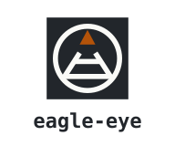
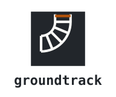

<p align="center">
  
</p>

<h1 align="center">G R I M O I R E</h1>

<p align="center"><strong>A spellbook of agent skills for AI. Cast wisely.</strong></p>

<p align="center">
  <a href="skills/contract"><picture><source media="(prefers-color-scheme: dark)" srcset="docs/brand/contract/contract-sigil-dark.svg"></picture></a>
  &nbsp;&nbsp;&nbsp;&nbsp;
  <a href="skills/head-chef"><picture><source media="(prefers-color-scheme: dark)" srcset="docs/brand/head-chef/head-chef-sigil-dark.svg"></picture></a>
  &nbsp;&nbsp;&nbsp;&nbsp;
  <a href="skills/eagle-eye"><picture><source media="(prefers-color-scheme: dark)" srcset="docs/brand/eagle-eye/eagle-eye-sigil-dark.svg"></picture></a>
  &nbsp;&nbsp;&nbsp;&nbsp;
  <a href="skills/groundtrack"><picture><source media="(prefers-color-scheme: dark)" srcset="docs/brand/groundtrack/groundtrack-sigil-dark.svg"></picture></a>
</p>

---

A **skill** is a folder of instructions your coding agent reads when the moment
calls for it — a reference book it knows when to open. Grimoire holds four.
contract helps you build a skill or an agent of your own. head-chef lets one
Claude Desktop session start and lead others, and comes with a pane that shows
them. eagle-eye and groundtrack do the same kind of work: they take something
you can only hold in your head and put it on a page you can look at.

**[See one before you install anything.][gallery]** The gallery holds every
page eagle-eye and groundtrack have drawn. Start with [a live decision grid][eagle-demo]
about whether to publish this repository. Click an option and
watch it recolour. eagle-eye wrote it, about itself.

## Install

Four skills today, more later. Works with any agent:

```bash
npx skills@latest add mephistopheles4/grimoire
```

That is [`skills`](https://github.com/vercel-labs/skills), which installs into
Claude Code, Cursor, Codex, Gemini CLI, Copilot, Windsurf, Zed, opencode, Amp
and around seventy more. It copies the whole skill directory, renderer
included.

**The Brigade pane needs grimoire installed as a Claude Code plugin.** The
command above copies skill folders only, so it gives you `head-chef` but not
`/brigade`. To get both, run:

```text
claude plugin marketplace add mephistopheles4/grimoire
claude plugin install grimoire@mephistopheles4
```

<details>
<summary><strong>Other ways to install</strong></summary>

**As a Claude Code plugin**, if you would rather the marketplace handled
updates:

```text
/plugin marketplace add mephistopheles4/grimoire
/plugin install grimoire@mephistopheles4
```

Plugin skills are namespaced, so that route invokes them as
`/grimoire:eagle-eye`, `/grimoire:groundtrack`, `/grimoire:contract` and
`/grimoire:head-chef`. The installer route keeps the plain `/eagle-eye`,
`/groundtrack`, `/contract` and `/head-chef`.

**By hand**, if you want neither installer:

```bash
git clone https://github.com/mephistopheles4/grimoire.git
cp -r grimoire/skills/eagle-eye ~/.claude/skills/
cp -r grimoire/skills/groundtrack ~/.claude/skills/
cp -r grimoire/skills/contract ~/.claude/skills/
cp -r grimoire/skills/head-chef ~/.claude/skills/
```

**Pinned to one commit**, if you want a copy that only changes when you
choose. Use the full 40-character commit SHA:

```bash
npx skills@latest add mephistopheles4/grimoire#<commit-sha>
```

No skill names a fixed path to its own scripts, so each runs from wherever it
lands. eagle-eye has been run from three directories: the author's
skills folder, the plugin install, and a copy made by `skills`.

</details>

Every route gives you all four skill directories, each with its `SKILL.md`
and the scripts that go with it. Only the plugin route also gives you the
Brigade pane. Each skill carries a README of its own, which is where it is
documented; contract and head-chef also carry the `CONTRACT.md` their
`SKILL.md` is generated from. What follows is only enough to tell you which
one you want.

---

##  [contract](skills/contract)

**Agree the terms first. The prompt is build output.**

Reach for it when you want a skill or an agent of your own and have never
written one. contract interviews you through a template, one group of
questions at a time, and writes your answers down as a contract. It calls what
you build a **familiar**: a skill or an agent that does one job for you.

It then generates the familiar's file from the contract and checks its format.
A mark in the file makes the check fail when anyone edits the file by hand. When a
familiar goes wrong, you amend the contract and generate the file again. It
never installs what it builds. Not for a one-off prompt.

The questions, the levels and the marks:
[`skills/contract/references/template.md`](skills/contract/references/template.md).
The skill's own contract, which its `SKILL.md` is generated from:
[`skills/contract/CONTRACT.md`](skills/contract/CONTRACT.md).

##  [head-chef](skills/head-chef)

**Lead the sessions; let them do the work.**

Reach for it in Claude Desktop when you want work to run in another session,
or want to lead several at once. head-chef starts each session in the
background, or as a Desktop session you work in, with the model and effort
set. It points the session to where its brief lives, takes its milestone
reports, relays between sessions, and cleans a session up when you say it is
done. It takes the when and the why from your own process, and it never
counts a message from another session as your yes to start, stop or delete.
The sessions it starts take any message from the lead as your decision, on
any matter, and the lead tells you in one line of each one it sends. A
session cannot tell a forged sender from the lead; read the skill's README
before you install. Not for work in the same session.

`/brigade` opens the Brigade pane: one card per session the lead started, with
its work, phase, settings, live busy or idle state, cache warmth and latest
report. A card that waits on you and holds a large context says when to reply
to keep its cache, or suggests a hand-off once it has gone cold. At its bottom
it shows the lead session's own rate limits and context. It needs
the plugin install above. The skill works without it.

What it does, what counts as your yes, and how cleanup refuses:
[`skills/head-chef/README.md`](skills/head-chef). The skill's contract, which
its `SKILL.md` is generated from:
[`skills/head-chef/CONTRACT.md`](skills/head-chef/CONTRACT.md).

##  [eagle-eye](skills/eagle-eye)

**A decision is made once it has been seen against the whole system.**

Reach for it when three or more decisions are open and one choice changes what
is possible in another: picking the cheap database changes what the deployment
can be, which changes who can be on call. Asked one at a time, those questions
hide the thing you need to see.

eagle-eye draws a **morphological box** instead — one row per decision, one
cell per option, an edge wherever two options rule each other out or require
each other — then renders a page that reads any configuration back. Not for two
independent choices.

**Live: [the decision to publish this repository][eagle-demo].**

The seven findings, why every edge carries an evidence tier, and the renderer's
flags: [`skills/eagle-eye/README.md`](skills/eagle-eye).

##  [groundtrack](skills/groundtrack)

**A reader who did not write a change cannot see its shape.**

Reach for it when a plan is made or the work is done and someone else has to
understand it. A change arrives as a list of files. A plan arrives as a list of
tickets. Neither says what calls what, what each part hands back, where it can
break, or what it needs in order to work.

groundtrack writes one call graph with recorded traces through it, renders a
self-contained page you can step a cursor across, and prints the same graph as
an indented tree on request. Not for a conversation, because nothing durable
exists to check the graph against.

**Live: [a pull request, stepped through][track-demo].** For a complex sheet,
see [a larger pull request with 88 nodes][track-complex].
Every published page is in [the gallery][gallery].

The three channels, what a layer redraws, the page's controls, and the honesty
property's stated limit:
[`skills/groundtrack/README.md`](skills/groundtrack).

---

The marks, the cards and the tokens behind them are in
[`docs/brand/`](docs/brand).

<details>
<summary><strong>How the repository is put together</strong></summary>

The repository **is** the plugin. `.claude-plugin/plugin.json` names it
`grimoire`; `.claude-plugin/marketplace.json` is the shelf that lists it with
`"source": "./"`. Skills sit at `skills/<name>/`, which is the one level the
default scan reads and the layout the `skills` installer finds first.

The two manifests carry different names on purpose: the shelf is
`mephistopheles4`, the book is `grimoire`. The version lives in `plugin.json`
and nowhere else, because a second copy is a second place to forget.

This shape follows [mattpocock/skills](https://github.com/mattpocock/skills),
which ships a marketplace manifest and a plugin manifest side by side at the
root. The Claude Code docs describe each separately and never that pairing, so
the evidence it works is a repository that does it, plus
`claude plugin validate .` passing here.

</details>

## Contributing

[`CONTRIBUTING.md`](CONTRIBUTING.md). The contract is one command:

```bash
node scripts/check.mjs
```

Security problems go through private reporting, not a public issue:
[`SECURITY.md`](SECURITY.md).

## Licence

[MIT](LICENSE). © 2026 Ayman Diab.

[eagle-demo]: https://mephistopheles4.github.io/grimoire/docs-decisions-publish-eagle-eye.html
[track-demo]: https://mephistopheles4.github.io/grimoire/skills-groundtrack-examples-pr-313.html
[track-complex]: https://mephistopheles4.github.io/grimoire/docs-examples-pr-382.html
[gallery]: https://mephistopheles4.github.io/grimoire/
