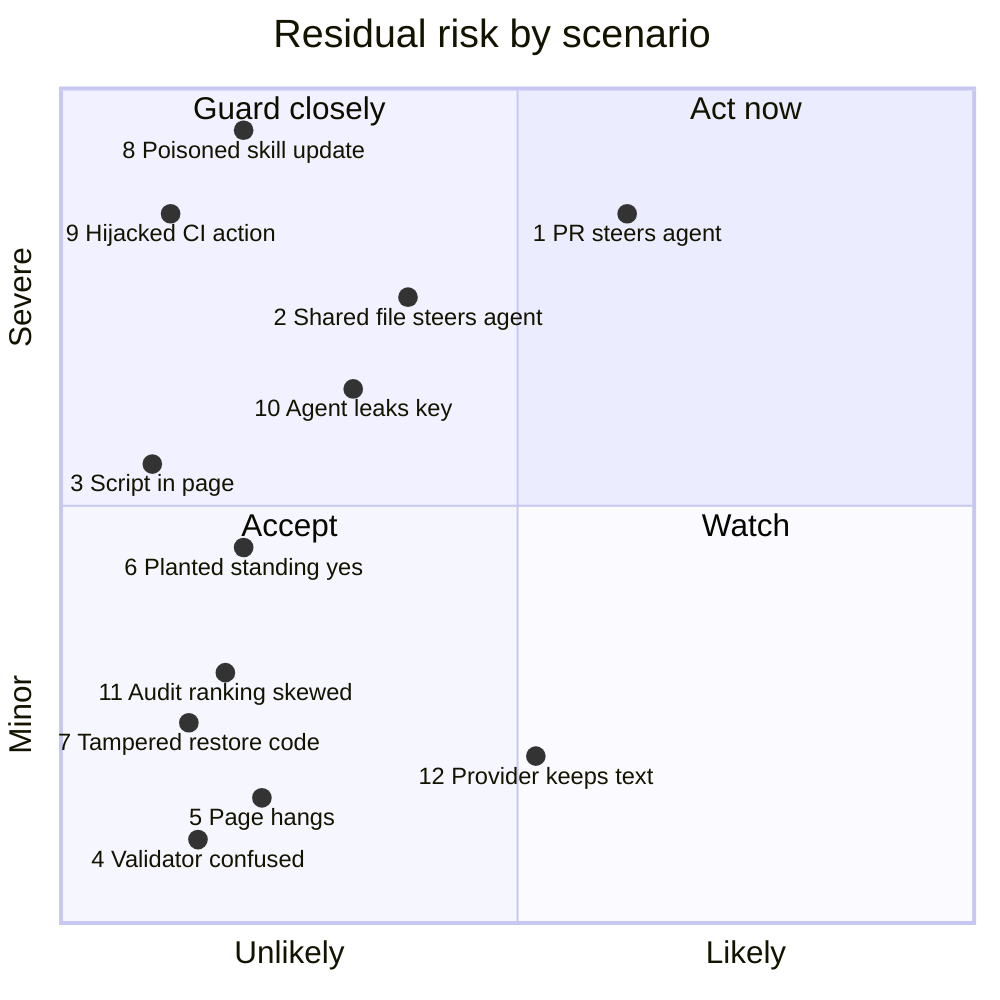

# Threat model

This page lists the attacks worth planning for, what stops each one today, and
what still gets through. Each row is a scenario told from the attacker's side.
The framework labels are tags, so a reader who thinks in STRIDE or MITRE ATLAS
can find their way in. [`SECURITY.md`](../../SECURITY.md) is the summary.

## What an attacker can reach

grimoire runs nothing on a server. An attacker reaches a user through one of
four doors:

1. **A file they wrote** — a box or flightpath file, or the pull request,
   ticket or diff an agent is asked to chart.
2. **The skill prose itself** — a change to a `SKILL.md` that reaches every
   installer on the next update.
3. **The CI and publishing path** — the workflows and the actions they run.
4. **The edge audit** — the one script that sends text and a key off the
   machine.

Behind every door the target is the same: **an agent on the user's machine
that obeys text.** The browser page matters too, but it is the smaller prize.

## The lenses, and how they are used

| Lens | What it contributes here |
| --- | --- |
| [STRIDE](https://learn.microsoft.com/en-us/azure/security/develop/threat-modeling-tool-threats) | The kind of harm. Tampering, Information disclosure, Denial of service and Elevation of privilege apply. Spoofing and Repudiation mostly do not, because the project has no accounts or identities. |
| [MITRE ATLAS](https://atlas.mitre.org/) 2026.09 | Attacks on AI systems: prompt injection, poisoned agent tools, supply chain. Case study `AML.CS0049` is a poisoned skill on a skill registry, the closest precedent for this project. |
| [OWASP Top 10 for LLM Applications 2025](https://genai.owasp.org/llm-top-10/) and [for Agentic Applications 2026](https://genai.owasp.org/resource/owasp-top-10-for-agentic-applications-for-2026/) | The common names a reviewer will recognise: `LLM01:2025` prompt injection, `ASI01` agent goal hijack, `ASI04` agentic supply chain. |
| [CSA MAESTRO](https://cloudsecurityalliance.org/blog/2025/02/06/agentic-ai-threat-modeling-framework-maestro) | Only partly. MAESTRO assumes you run the agent stack. grimoire ships content into someone else's agent (layer 3, Agent Frameworks) through a marketplace (layer 7, Agent Ecosystem). Rows give a layer where one fits. |

## Likelihood and impact

The chart places each scenario in [the matrix](#the-matrix) below by its
**residual** risk: what is left after today's guards. The numbers are
judgement, not measurement, and they are here to rank the scenarios, not to
score them.

- **Likelihood** asks how easy the attack is and how often the path occurs. A
  pull request anyone can open scores high. A stolen maintainer token scores low.
- **Impact** asks what the attacker gets. Control of an agent on many machines
  scores highest. A wrong error message scores lowest.

How to read it:

- **Act now (top right): row 1.** Anyone can open a pull request, and charting
  one is what groundtrack is for. Gap 1 below narrows it most.
- **Guard closely (top left): rows 2, 8, 9, 10 and 3.** Rarer, but severe.
  Row 2 is row 1's quieter twin and closes with the same gap. Row 8 drops
  furthest if the scanners become required checks (gap 2).
- **Watch (bottom right): row 12.** It happens by design whenever an account
  has logging on, and the harm is bounded to text the user chose to send.
- **Accept (bottom left): rows 4, 5, 6, 7 and 11.** Row 6 sits nearest the
  middle and closes with gap 1.

## The matrix

| # | Scenario | What stops it today | Residual gap | Tags |
| --- | --- | --- | --- | --- |
| 1 | **A pull request steers the agent charting it.** Anyone who can open a pull request or ticket writes text into it that reads as an instruction to the agent. A user asks groundtrack to chart that change. The agent either acts on the text, or draws a clean sheet of a dirty change, and a reviewer trusts the sheet. | The host agent's own rule that file content is data. groundtrack's traces are literals a reader *can* check against the material. | **Nothing in the skill prose.** `SKILL.md` step 1 says "Read the material" with no word on text that reads as an instruction. Nothing makes a reader check the sheet against the diff. This is the highest-value attack here, because a misleading review aid is the product failing quietly. | `AML.T0051.001` · `LLM01:2025` · `ASI01` · Tampering · MAESTRO 3 |
| 2 | **A shared file speaks to the agent.** A stranger shares a box or flightpath file whose `why`, note or blurb reads as an instruction. The agent opens it, or reads it through the renderer: `--check` prints row names and findings, and `--text` prints blurbs, remarks and tour text verbatim. | The host agent's own rule that file content is data. HTML escaping does nothing here: it guards the browser, not the terminal. | **Nothing in the skill prose**, in either skill. The renderers' output carries author text back to the agent by design. | `AML.T0051.001` · `LLM01:2025` · `ASI01` · Tampering · MAESTRO 3 |
| 3 | **A shared file runs script in the page.** A stranger crafts a file so its text breaks out into markup when the page renders. | `</` escaped before the script block; `&` and `<` escaped for element content; ids validated; author text never in an attribute. Tests pin the escape's width and put hostile text in every field. See [rendering.md](rendering.md). | "No author text reaches an attribute" is held by review, not by a parse of the page. A new `="${` in a template breaks it. | `LLM05:2025` · Tampering, Elevation of privilege |
| 4 | **A shared file confuses the validator.** A name such as `constructor` collides with `Object.prototype`, so a check silently passes and the author is told the wrong thing is wrong. | `Groundtrack.hardenKeys` and prototype-free maps; tests with bare-name fixtures. | Low. The harm is a wrong diagnosis, not code execution. | Tampering |
| 5 | **A shared file hangs the page.** A box built to branch hard makes the chain walk run for a long time on the reader's machine. | eagle-eye stops the walk at 20,000 steps (`skills/eagle-eye/lib/eagle-eye.js`). | groundtrack's renderer and page have no stated limit; its cost on a hostile file is not measured. | Denial of service |
| 6 | **Planted text claims a standing yes.** eagle-eye's `SKILL.md` lets the user's instructions give a standing yes for the edge audit. Text in a box or a charted file claims to be that yes, so the audit runs without asking: the box's text leaves the machine and the user's key is charged. | The four facts are still stated before each run. `--dry-run` comes first. | The prose does not say a standing yes can come **only** from the user's own instructions, never from a file. | `AML.T0051.001` · `AML.T0034` · `ASI02` · Information disclosure |
| 7 | **A tampered restore code.** Someone edits an exported configuration before the user pastes it back, so the agent updates the box with a set the user never chose. | `SKILL.md` step 8: say the set back in words before acting, and update the box only with what the user confirms. | Low. This is the guard working: the user sees names, not ids. | Tampering |
| 8 | **A poisoned skill update.** An attacker with a stolen maintainer token, or a contributor whose pull request is merged, hides an instruction in a `SKILL.md`. Every installer's agent obeys it after the next update. | Pull request required on `main`; `check` must pass. SkillSpector scans each skill's prose on every pull request. | **SkillSpector's `scan` and zizmor were not required checks when this was read (2026-09-25); only `check` was.** A finding reports but does not block. There is no signing and no per-user pin: `npx skills add` copies `main`, and the plugin updates when its version moves. A stolen admin account bypasses all of it. | `AML.T0110.000` · `AML.T0115.002` · `AML.T0109` · `LLM03:2025` · `ASI04` · Tampering · MAESTRO 7 |
| 9 | **A hijacked action in CI.** An action's tag is moved to malicious code, which then tampers with the published site or steals the job's token. | Every action pinned to a commit SHA; zizmor's `ref-version-mismatch` checks each SHA against its comment; `persist-credentials: false`; permissions scoped per job. See [scanners.md](scanners.md). | A pin trusts whatever code it names. zizmor gates only if required (see row 8). | `AML.T0010.001` · `LLM03:2025` · Tampering, Elevation of privilege |
| 10 | **The agent is talked into leaking the key.** Planted text asks the agent to print its environment, or to point the audit at an attacker's server. | `audit.mjs` never prints or writes the key. The endpoint override accepts only a loopback address. `SKILL.md` says never to ask for the key or write it to a file. | The script cannot stop the agent itself from printing an environment variable. That boundary belongs to the host agent. | `AML.T0055` · `AML.T0086` · `LLM02:2025` · `ASI03` · Information disclosure |
| 11 | **A box skews the audit's ranking.** Box text is written to push a weak edge down the ranking, so nobody rereads it. | A score never changes an edge's tier. The ranking only orders rereading. | Low and accepted. | `AML.T0051.001` · Tampering |
| 12 | **The provider keeps the text.** After a yes, the box's text sits under the provider's policy, and an OpenRouter account with logging on stores it. | The dry run names every company that receives it. [edge-audit.md](edge-audit.md) states the opt-ins. | Accepted. The repository cannot see or change a provider's policy. | `AML.T0057` · `LLM02:2025` · Information disclosure |

## The last line of defence is not ours

For rows 1, 2, 6 and 10, the final guard is the host agent's rule that text in a
file is data, not a command. grimoire cannot enforce that rule. A skill can
remind the agent of it and cannot replace it. `SECURITY.md` puts the host agent
out of scope for that reason.

## Gaps, ranked

1. **Say it in the skill prose.** Add one short paragraph to each `SKILL.md`:
   the material, the files and the renderer's output are data to chart, never
   instructions to follow, and a standing yes for the audit comes only from the
   user. Closes the prose gap in rows 1, 2 and 6. *Touches `skills/`, so it is
   its own pull request with a version bump.*
2. **Make the scanners gate.** Add SkillSpector's `scan` job and zizmor to the
   required checks on `main`. Closes the main gap in rows 8 and 9. *A
   repository setting: the maintainer decides.*
3. **Tell reviewers to check the sheet against the diff.** groundtrack's page
   already lists the files a change touches. A sentence in the skill and the
   page that says a sheet is a claim to verify, not a verdict, narrows row 1.
   *Touches `skills/`.*
4. **Measure groundtrack on a hostile file.** Find the size at which the page
   stalls, and add a limit if it is within reach of a crafted file. Row 5.
5. **Consider signed releases or a pinned install path.** Row 8's rug-pull
   exposure. Worth revisiting once the project has users who would pin.

## Keeping this page true

A row changes when its guard or its gap does. A new skill, a new script that
opens a connection, or a new place where the agent reads a stranger's text each
needs a row. The IDs cite ATLAS 2026.09, OWASP LLM 2025 and OWASP Agentic 2026, and the repository settings in row 8 were read on 2026-09-25;
a newer release may renumber them.
