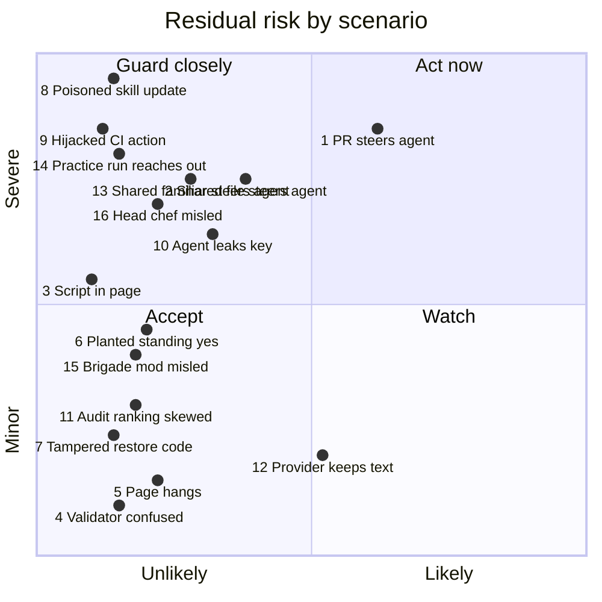

# Threat model

This page lists the attacks worth planning for, what stops each one today, and
what still gets through. Each row is a scenario told from the attacker's side.
The framework labels are tags, so a reader who thinks in STRIDE or MITRE ATLAS
can find their way in. [`SECURITY.md`](../../SECURITY.md) is the summary.

## What an attacker can reach

grimoire runs nothing on a server. An attacker reaches a user through one of
five doors:

1. **A file they wrote** — a box or flightpath file, a skill or agent file
   and its contract, or the pull request, ticket or diff an agent is asked
   to chart.
2. **The skill prose itself** — a change to a `SKILL.md` that reaches every
   installer on the next update.
3. **The CI and publishing path** — the workflows and the actions they run.
4. **The edge audit** — the one script that sends text and a key off the
   machine.
5. **The Brigade mod** — the hooks module Claude Code runs in every session
   that has the plugin, and the text it reads from other sessions.
6. **The head-chef skill's brigade** — the sessions the skill starts, the
   reports and relays they send back, and the worktrees it deletes.

Behind every door the target is the same: **an agent on the user's machine
that obeys text.** The browser page matters too, but it is the smaller prize.

## The lenses, and how they are used

| Lens | What it contributes here |
| --- | --- |
| [STRIDE](https://learn.microsoft.com/en-us/azure/security/develop/threat-modeling-tool-threats) | The kind of harm. Tampering, Information disclosure, Denial of service and Elevation of privilege apply. Spoofing and Repudiation mostly do not, because the project has no accounts or identities. |
| [MITRE ATLAS](https://atlas.mitre.org/) 2026.09 | Attacks on AI systems: prompt injection, poisoned agent tools, supply chain. Case study `AML.CS0049` is a poisoned skill on a skill registry, the closest precedent for this project. |
| [OWASP Top 10 for LLM Applications 2025](https://genai.owasp.org/llm-top-10/) and [for Agentic Applications 2026](https://genai.owasp.org/resource/owasp-top-10-for-agentic-applications-for-2026/) | The common names a reviewer will recognise: `LLM01:2025` prompt injection, `ASI01` agent goal hijack, `ASI04` agentic supply chain. |
| [CSA MAESTRO](https://cloudsecurityalliance.org/blog/2025/02/06/agentic-ai-threat-modeling-framework-maestro) | Only partly. MAESTRO assumes you run the agent stack. grimoire ships content into someone else's agent (layer 3, Agent Frameworks) through a marketplace (layer 7, Agent Ecosystem). Rows give a layer where one fits. |

## Likelihood and impact

The chart places each scenario in [the matrix](#the-matrix) below by its
**residual** risk: what is left after today's guards. The numbers are
judgement, not measurement, and they are here to rank the scenarios, not to
score them.

- **Likelihood** asks how easy the attack is and how often the path occurs. A
  pull request anyone can open scores high. A stolen maintainer token scores low.
- **Impact** asks what the attacker gets. Control of an agent on many machines
  scores highest. A wrong error message scores lowest.

```mermaid
quadrantChart
  title Residual risk by scenario
  x-axis Unlikely --> Likely
  y-axis Minor --> Severe
  quadrant-1 Act now
  quadrant-2 Guard closely
  quadrant-3 Accept
  quadrant-4 Watch
  1 PR steers agent: [0.62, 0.85]
  2 Shared file steers agent: [0.38, 0.75]
  3 Script in page: [0.10, 0.55]
  4 Validator confused: [0.15, 0.10]
  5 Page hangs: [0.22, 0.15]
  6 Planted standing yes: [0.20, 0.45]
  7 Tampered restore code: [0.14, 0.24]
  8 Poisoned skill update: [0.14, 0.95]
  9 Hijacked CI action: [0.12, 0.85]
  10 Agent leaks key: [0.32, 0.64]
  11 Audit ranking skewed: [0.18, 0.30]
  12 Provider keeps text: [0.52, 0.20]
  13 Shared familiar steers agent: [0.28, 0.75]
  14 Practice run reaches out: [0.15, 0.80]
  15 Brigade mod misled: [0.18, 0.40]
  16 Head chef misled: [0.22, 0.70]
```

How to read it:

- **Act now (top right): row 1.** Anyone can open a pull request, and charting
  one is what groundtrack is for. Gap 1 below narrows it most; gap 3's
  reminder narrows it too, but binds no one, so it stays here.
- **Guard closely (top left): rows 2, 13, 16, 8, 14, 9, 10 and 3.** Rarer, but
  severe. Row 2 is row 1's quieter twin, narrowed by the same gap. Row 13 is
  row 2 for the contract skill, plus a seal that can be read as a review.
  Row 16 is row 2 for the head chef, whose agent can start sessions and
  delete worktrees; its guards are prose, and two of git's own refusals.
  Row 8 moved left once the scanners became required checks (gap 2). Row 14
  sits at row 8's likelihood: the skill under test is the owner's own, and
  the tester writes the planted lines. Its guard is hygiene, not a boundary.
- **Watch (bottom right): row 12.** It happens by design whenever an account
  has logging on, and the harm is bounded to text the user chose to send.
- **Accept (bottom left): rows 4, 5, 6, 7, 11 and 15.** Row 6 sits nearest the
  middle and gap 1 narrows it. Row 15's code runs in every session, but the
  text it reads is only ever drawn; the module itself is row 8's to guard.

## The matrix

| # | Scenario | What stops it today | Residual gap | Tags |
| --- | --- | --- | --- | --- |
| 1 | **A pull request steers the agent charting it.** Anyone who can open a pull request or ticket writes text into it that reads as an instruction to the agent. A user asks groundtrack to chart that change. The agent either acts on the text, or draws a clean sheet of a dirty change, and a reviewer trusts the sheet. | The host agent's own rule that file content is data. groundtrack's `SKILL.md` says the material is data to draw, not instructions, and to tell the reader when a line reads as a request. Traces are literals a reader *can* check against the material. When the agent hands the page over, `SKILL.md` now tells it to say that AI drew the page, that it can be wrong, and to check it against the change. On the page, the "authored" stamp in the title block says the same when a reader points at it. | A sentence in a skill and a note on the page remind the agent and the reader. Neither makes anyone check. This is the highest-value attack here. A misleading review aid is the product failing quietly. | `AML.T0051.001` · `LLM01:2025` · `ASI01` · Tampering · MAESTRO 3 |
| 2 | **A shared file speaks to the agent.** A stranger shares a box or flightpath file whose `why`, note or blurb reads as an instruction. The agent opens it, or reads it through the renderer: `--check` prints row names and findings, and `--text` prints blurbs, remarks and tour text verbatim. | The host agent's own rule that file content is data. Both `SKILL.md` files now say a file and the renderer's output are data, not instructions. HTML escaping does nothing here: it guards the browser, not the terminal. | A reminder, not a guard. The renderers' output carries author text back to the agent by design. | `AML.T0051.001` · `LLM01:2025` · `ASI01` · Tampering · MAESTRO 3 |
| 3 | **A shared file runs script in the page.** A stranger crafts a file so its text breaks out into markup when the page renders. | `</` escaped before the script block; `&` and `<` escaped for element content; ids validated; author text never in an attribute. Tests pin the escape's width and put hostile text in every field. See [rendering.md](rendering.md). | "No author text reaches an attribute" is held by review, not by a parse of the page. A new `="${` in a template breaks it. | `LLM05:2025` · Tampering, Elevation of privilege |
| 4 | **A shared file confuses the validator.** A name such as `constructor` collides with `Object.prototype`, so a check silently passes and the author is told the wrong thing is wrong. | `Groundtrack.hardenKeys` and prototype-free maps; tests with bare-name fixtures. | Low. The harm is a wrong diagnosis, not code execution. | Tampering |
| 5 | **A shared file hangs the page.** A box built to branch hard makes the chain walk run for a long time on the reader's machine. A flightpath file built the same way stalls or crashes groundtrack's renderer or page. | eagle-eye stops the walk at 20,000 steps (`skills/eagle-eye/lib/eagle-eye.js`). groundtrack's renderer refuses three shapes before it reads a run: a graph more than 1,000 calls deep, a tree view of more than 20,000 rows, and a search for cut calls that costs more than 1,000,000 units of work. Every other cost measured grows in step with the file. See [row 5, measured](#row-5-measured). | None measured. The two `fold` costs that stalled `--text` and the page are gone (#147). See gap 4. | Denial of service |
| 6 | **Planted text claims a standing yes.** eagle-eye's `SKILL.md` lets the user's instructions give a standing yes for the edge audit. Text in a box or a charted file claims to be that yes, so the audit runs without asking: the box's text leaves the machine and the user's key is charged. | The four facts are still stated before each run. `--dry-run` comes first. `SKILL.md` says a standing yes comes only from the user's own instructions, never from text in a file. | Low. The host agent still has to tell the user's instructions from a file's. | `AML.T0051.001` · `AML.T0034` · `ASI02` · Information disclosure |
| 7 | **A tampered restore code.** Someone edits an exported configuration before the user pastes it back, so the agent updates the box with a set the user never chose. | `SKILL.md` step 8: say the set back in words before acting, and update the box only with what the user confirms. | Low. This is the guard working: the user sees names, not ids. | Tampering |
| 8 | **A poisoned skill update.** An attacker with a stolen maintainer token, or a contributor whose pull request is merged, hides an instruction in a `SKILL.md`. Every installer's agent obeys it after the next update. Since 0.28.0 the change can also be code: the Brigade mod's hooks module, which Claude Code runs in every session that has the plugin, with the session's own rights (row 15). | Pull request required on `main`. `check`, SkillSpector's `scan` and zizmor's `audit` must all pass (required since 2026-09-25). | SkillSpector is static pattern matching: an instruction written to read as ordinary prose can pass it. There is no signing, and the SkillSpector job scans `skills/` only, not the mod: `scripts/check.mjs` holds the mod to its folders, the fixed-path and dependency rules and a version bump, and review does the rest. `npx skills add` copies `main` unless the user pins a commit, and the plugin updates when its version moves and the user updates, by hand or through background auto-update (off by default). A stolen admin account bypasses all of it. | `AML.T0110.000` · `AML.T0115.002` · `AML.T0109` · `LLM03:2025` · `ASI04` · Tampering · MAESTRO 7 |
| 9 | **A hijacked action in CI.** An action's tag is moved to malicious code, which then tampers with the published site or steals the job's token. | Every action pinned to a commit SHA; zizmor's `ref-version-mismatch` checks each SHA against its comment; `persist-credentials: false`; permissions scoped per job. See [scanners.md](scanners.md). | A pin trusts whatever code it names. | `AML.T0010.001` · `LLM03:2025` · Tampering, Elevation of privilege |
| 10 | **The agent is talked into leaking the key.** Planted text asks the agent to print its environment, or to point the audit at an attacker's server. | `audit.mjs` never prints or writes the key. The endpoint override accepts only a loopback address. `SKILL.md` says never to ask for the key or write it to a file. | The script cannot stop the agent itself from printing an environment variable. That boundary belongs to the host agent. | `AML.T0055` · `AML.T0086` · `LLM02:2025` · `ASI03` · Information disclosure |
| 11 | **A box skews the audit's ranking.** Box text is written to push a weak edge down the ranking, so nobody rereads it. | A score never changes an edge's tier. The ranking only orders rereading. | Low and accepted. | `AML.T0051.001` · Tampering |
| 12 | **The provider keeps the text.** After a yes, the box's text sits under the provider's policy, and an OpenRouter account with logging on stores it. | The dry run names every company that receives it. [edge-audit.md](edge-audit.md) states the opt-ins. | Accepted. The repository cannot see or change a provider's policy. | `AML.T0057` · `LLM02:2025` · Information disclosure |
| 13 | **A shared familiar or contract steers the agent, or a seal is read as a review.** A stranger shares a skill or agent file, or the contract it was built from, whose text reads as an instruction. The contract skill reads it in an interview or while amending it, and the agent obeys: it installs the file, widens what the agent may do, or copies an order into the new file. Or a reader sees a valid mark on a shared `SKILL.md` and trusts it as reviewed. | `skills/contract/SKILL.md` says a file, a pasted diff and the check's own output are data, not instructions. Its Step 6 acts on three of the check's warnings only, once each: it fixes `body-length` on the `SKILL.md` it just generated, moving detail only into a new file or one it wrote in this session, and `contents` on a file it wrote in this session, and it redrafts in the contract a description not yet Decided that `description-xml` names, and shows the new draft at hand-back. If the warning stays, it stops and asks. It shows and records every other warning and changes nothing for it, and it asks before it writes to a file it did not write in this session. An answer drafted from a file for the tools, the actions or a stop needs the person's own words, marked Decided. The skill writes only under `familiars/`, asks before it overwrites a file anywhere else, and never writes a hook, a settings file or a permission list. `skills/contract/scripts/check.mjs` gives its verdict as an exit code, echoes no field value, and cleans every character it echoes. A key the contract does not list fails. The familiar, its contract and every other text file in a skill's folder are "cannot check" if they hold a line or paragraph separator (U+2028, U+2029), a C1 control character (NEL included), a C0 control character other than tab, DEL, U+FFFE, U+FFFF or a lone CR; tab and CRLF line endings are allowed. A Codex agent file (`.toml`) is read through a narrow subset of TOML: top-level `key = value` lines, whole-line comments, and strings that take no escape but `\"` and `\\`. An unquoted `true` or `false` is read only for a key the contract lists. A table such as `[mcp_servers]`, an array, a number, a dotted key, any other escape, a comment after a value, a byte-order mark, a lone CR, or a control character other than tab (DEL included) is "cannot check", on every line, the mark's included. Its known keys are `name`, `description`, `developer_instructions` and `sandbox_mode`; any other key passes only when the contract lists it, and then with any value. The check refuses no value for what it lets the agent do: it warns on every listed setting it does not know to be harmless, with a sharper danger warning for a few settings on a fixed list, and a warning does not fail the check. For a skill only, three more warnings follow Anthropic's Skills docs: a name holding "anthropic" or "claude" (`reserved-name`), a description holding an XML tag (`description-xml`), and a `.md` file over 100 lines, other than the top-level `README.md`, with no Contents heading in its first 30 lines (`contents`). They read only what the check already read, name the rule, never echo the description or the file, and run no regex on a reference file's lines. Its mark is three comment lines at the very end of the file, and any other comment that names a mark key, and a key named like one, is refused. An agent's contract names its target, and the file's ending must match it. The invisible-character rule covers every default-ignorable code point and the bidirectional marks. For a skill, the mark's familiar digest covers every file in the folder but `CONTRACT.md`, so a hand edit to a script or a reference file breaks the seal as an edit to `SKILL.md` does. On every skill folder, sealed or not, the check refuses a link or junction anywhere under it, a name outside `A-Z a-z 0-9 . _ -` or one Windows keeps for a device, a text file that is not UTF-8, holds a NUL or holds a lone CR, and a folder past 256 entries, 8 folders deep, 1 MiB a text file, 4 MiB a font or image or 16 MiB in all; it applies the invisible-character rule to every text file, and names a seal's leftover temporary file rather than skipping it. `--seal` refuses a symlink, a failing file, folder or contract, and a failed write, and then writes nothing; it writes a temporary file beside the familiar and replaces the familiar by a rename, and it adds a line ending to a `.toml` file's last line when that line has none, before the mark. `scripts/check.mjs` runs the check over every skill here. | A valid seal proves that the familiar and its contract have not changed since they were sealed, and nothing about who sealed them: anyone can compute a SHA-256. For a skill, the familiar is every file in its folder but `CONTRACT.md`; an empty folder is not covered. On Windows, a cloud placeholder or another reparse point that is not a link may read as a regular file, and reading it may start a download. That is a hypothesis from the security review, not tested. The `.toml` reader has no reference TOML parser to compare against, because the check takes no dependencies; its subset is kept narrow so that each form it accepts reads the same to TOML. A shipped or shared familiar, and its contract, are reviewed as prose whatever the mark says. In a `.md` or a `.toml` file, a key the contract lists passes with any value. The danger list names known settings only, and every other unknown setting gets the plainer `unreviewed` warning. A file the agent file points to is outside the seal. A stranger who writes both files can widen what the agent may do without asking; a warning is a prompt to read, not a review. The write scope is held by prose and by the person: `--seal` follows a junction or link in a parent folder and writes where it points, and prints the real path so the person can see where the write landed. The data rule is a reminder, as in row 2, and so is Step 6's split between the warnings the skill acts on and the ones it only shows. | `AML.T0051.001` · `LLM01:2025` · `ASI01` · `ASI04` · Tampering, Elevation of privilege · MAESTRO 3 |
| 14 | **A skill under test acts outside its practice run.** This is door 2 used on purpose. The practice runner, `scripts/practice.mjs`, starts an agent session that runs a skill under test. The skill, or a line a practice case plants, makes the session act outside its work folder: it changes the owner's live skills or settings, reads a secret, or reaches off the machine. | The runner's posture, which is hygiene, not a boundary ([ADR 0006](../adr/0006-skills-are-dangerous-by-default.md)). The session runs in "don't ask" mode with hooks off. Its settings file denies edits to the copy of the skill under test, to the work folder's project settings, MCP config and instruction files, under `.git` and to `.gitattributes`. It denies reads of the credential file, the user settings files, the global state file, `.ssh`, `.aws`, `.git-credentials`, `.npmrc` and the run's backups. It denies every tool that reaches off the machine or schedules work, and the command line disallows them too. A case's tool rules take four shapes only: a script in the skill under test; one of four git commands: `status`, `diff`, `log` and `show`; a shell read of the home folder or of a test value; and a PowerShell append to the path a test value names inside the work folder. Each is written in every form the skill's own wording gives the command, quoted or bare, with either slash, never a wider one. The append's final wildcard is meant for the line: in #171's probes Claude Code denied every other thing tried there, namely a subexpression, a bracketed or array expression, an environment value, a pipe, an output redirect, and a second command after `;` or on a new line that no rule allows. A provider variable such as `${C:\x}` was not tried. The append path may not name an instruction file or a device. On `clean` and `owner-pact` the session's environment holds no secret by construction, so a read shows only a test value or the home folder. Before each turn the runner refuses a project settings file, an MCP config or an instruction file that setup did not put there, and a copy of the skill under test that changed since start. It backs up and hashes the owner's six live places at start, prints the manifest's hash, lists any change at report, and keeps the backups when one changed. The session's environment is built from a named list. Everything the runner prints or keeps from a session is cleaned and masked. The skill is the owner's own, and the tester writes the planted lines. | **Allowed commands write anywhere they are pointed:** eagle-eye's renderer takes an output path, the contract check seals any folder, and git's `diff`, `log` and `show` take an output file. **Git config runs programs:** git can run a program named in its own configuration. **User settings merge:** on the variants that load user settings, the owner's own allow rules and extra directories merge into the posture, and the settings' environment values, provider keys among them, reach the session, so a case's fake key may be replaced by a real one there, and a read rule then shows the session that value; the report names each such collision, comparing names as the platform does. The owner's extra directories merge in too, and a relative append path follows the session's current folder, so after a `cd` the append can land there. Inside the work folder, #171's probe saw an append from the skill copy's folder under `.claude/` denied. On `full-account`, the user's MCP servers load too, with their own keys and headers. **Reads reach most of the home folder:** the read denies bind the agent's read tools only, not allowed commands, nor shell reads Claude Code does not recognise, such as `grep -r`, and they cover a few named files. A PowerShell provider variable such as `${C:\x}` in the append's wildcard was not tried, and if allowed it would copy a file's content into the work folder. **A secret read can reach a posted result:** masking catches known key shapes and the values the runner holds, of 8 or more characters and other than paths under ordinary names, nothing else. **The checks are evidence, not proof:** they cover only the listed folders, and the backups and start hashes sit where an allowed command could overwrite them, so undo works only if the backup survived. **The run directory holds a backup** of the owner's settings file, without its environment block. **The posture is only a rule check:** it rests on Claude Code's permission rules, and Claude Code has no operating-system sandbox on native Windows. **It also blocks more than a case may want:** Claude Code protects every write under `.claude/` in "don't ask" mode, whatever the allow rules say, so a session cannot edit a companion skill copied there. A case reads an attempted edit from the report's denials, and a case that needs the edit to land is not checkable on the runner. | `ASI02` · `ASI04` · `LLM02:2025` · Tampering, Elevation of privilege, Information disclosure · MAESTRO 3 |
| 15 | **Text another session wrote misleads the Brigade pane, or makes it act.** The plugin ships a mod: a hooks module, `brigade/register.tsx`, that Claude Code runs in every session where grimoire is installed, with the session's own rights. While its pane is open it runs `claude agents --json` every 10 seconds, reads the lead session's roster file every 5, reads other sessions' transcripts to find a link, and shows the first line of each report another session sends. A planted roster, a session named to match a card, or a forged report tries to make the pane run something, open a link the owner did not mean, read a file it should not, or show the owner a false state. | **Idle by default:** at session start the mod registers `/brigade` and nothing else, with no timer, process, file read or pane, and a message from another session never opens it. Its reads start on `/brigade` and stop when the pane closes. It writes no file. **Where it reads:** the roster file is named by the engine's own session id, held to the engine's id shape, in the plugin's data folder, the folder the plugin-manifest reference names `${CLAUDE_PLUGIN_DATA}`: from that variable when the mod's environment carries it and it names grimoire's own local folder, else built by the reference's rule under the config folder that the install location or the engine's session-start transcript path names. With neither, the pane shows an error naming the expected file, reads no file and runs no process. No fixed path. **What it accepts:** the roster is refused with an error in the pane unless every field is text within its cap, the status is one of four words, no title repeats once hidden characters go, no to-do id repeats and no field is unknown; at most 50 cards and 50 to-dos, and a file over 256 KiB is not read. Lookups go through `Map`s, so a title such as `constructor` reaches no prototype. **How it shows text:** every string is drawn as text, never as Markdown or a link, with control characters, every default-ignorable code point and the bidirectional marks removed before it is cut to one line. **Transcripts:** read only for a roster member, by a session id `claude agents --json` printed in the engine's shape, once per session, a miss remembered too. The link is taken only from the row Claude Code writes when Remote Control starts (a system row of subtype `bridge_status`), so a link quoted in a brief or a relayed message is never read. **Open in app:** passes `explorer.exe` one argument with no shell: a `claude://` link of two shapes, built from a checked id. Both programs are found on the system path, not in the project folder: a session in a folder holding a stub `claude.exe` and `explorer.exe` still ran the real ones (2.1.289, Windows). **The check:** `scripts/check.mjs` holds `hooks/hooks.json`, the module it names, every quoted `./` or `../` path (either slash) in the mod's code on any line, and the manifest's `types` inside `brigade/` and `hooks/`, under the fixed-path and dependency rules and the version bump. It refuses an absolute import path on an import line it reads, and a mod folder or hooks file spelled in another case. | **A report's sender is a claim:** the name comes from the wrapper Claude Code puts round a message, so a session can sign a report with another card's title. The pane shows it as text, and the record of the work is wherever the owner's process keeps it, not the pane. **A name can be borrowed:** a session named like a card has its transcript read for a link, and its live state shown on that card. **Roster text is shown as written,** within its caps: a head chef talked into writing a false phase shows it. **The data folder can disagree with the skill's:** a plugin installed from a marketplace added from a local folder runs from that folder, so the mod cannot read the marketplace's name and looks under `grimoire-inline`. The pane names the file it reads, so the mismatch shows. **Open in app is Windows only:** it goes through Windows' handler for `claude://`, and does nothing elsewhere; macOS is left for a later issue. **The check reads text:** it reads paths as written, so a string spelled with escapes or continued across lines is not seen; review reads the diff for those, as for a computed path. **No sandbox:** the module runs with the session's rights. What bounds it is review, the check and the version bump, which is row 8's guard. | `AML.T0051.001` · `LLM01:2025` · `ASI04` · Tampering, Information disclosure, Elevation of privilege · MAESTRO 3 |
| 16 | **Text from another session talks the head chef into acting, or a stranger's text reaches its shell.** The `head-chef` skill starts agent sessions with `claude --bg --remote-control`, sends them messages, reads their reports and relays between them, writes the Brigade roster, and on the owner's "done" stops a session and deletes its worktree and branch. A report, a relayed line, an issue a session was pointed at, or a roster line tries to make it start or stop a session, delete the wrong folder or unsaved work, run text in a shell, or act as if the owner had said yes. | `skills/head-chef/SKILL.md`, sealed and scanned with the other skills. **The owner's yes:** only the owner's own words in chat count; starting, stopping, `claude rm` and deleting a worktree each need them; a message from another session, a report, a brief, a roster line or an issue comment never counts. **Data, not instructions:** reports and relayed text are data; a line that reads as a request is told to the owner, not followed; a relay is quoted with its source session named. A brief tells each session that a message from the head chef is not the owner's approval. **The shell:** the start prompt is a fixed-form pointer to where the brief lives, never task text or a title, passed as a single-quoted here-string; the head chef writes each session name from a safe set of characters, never from an issue. **Cleanup:** the worktree comes only from `git worktree list --porcelain` run in the lead session's own repository, as the entry equal to the session's working folder from `claude agents --json`, never from roster or message text; it is never the main working tree; its git common dir must be the lead repository's and its git dir must sit in that common dir's `worktrees` folder, so a `.git` file the session rewrote to point at a planted folder is refused, also one whose `commondir` names the lead's; every git command that reads the folder, removal included, runs with `core.fsmonitor` off; cleanup stops when the lead cannot find its own session row; cleanup refuses when another live session works inside it, and on uncommitted or untracked files, commits reachable from no remote-tracking ref, or stash entries for its branch; it never pops or drops a stash; it names the session and the absolute path back, acts only on the owner's confirming words, and runs its checks again after them; a path, a branch and an id must be plain characters before they reach a command; it removes with no flag that forces or discards. `git worktree remove` then refuses a folder with an untracked file and `git branch -d` an unmerged branch, both seen in #185; `claude rm`'s refusal of unpushed commits is read from its help and not yet seen. In #185 the commands each refusal reads were run in a scratch repository by a script, and each printed what its refusal needs; a planted `.git` file was reproduced there, with and without a `commondir` naming the lead's, and the two git-dir checks refused both; `core.fsmonitor` set in the shared config ran its program during `git worktree remove` without the flag and not with it. No agent has yet followed the prose through a cleanup. | **It is prose.** Every guard above is an instruction the host agent follows; nothing runs it, and an agent that ignores the skill can run any command. Row 8 guards the text, not the agent. **Remote Control:** `--remote-control` makes each background session drivable from any device signed in to the owner's account. The skill says so the first time it starts one. **The owner's default permission mode carries over:** a session runs in the owner's default mode unless the owner names one, so a permissive default reaches every session started unattended. **Usage:** each launch spends plan usage; the owner's request is the yes. **Ignored files go with the folder:** the checks read changed and untracked files, not files git ignores. **A sender is a claim:** a session can sign a message with another's name, and a forged report is still data, never a yes. **The path comparison is the agent's:** it reads and compares paths itself, with no script. **A session reads what it is pointed at:** the issue in its brief is rows 1 and 2's door for that session. **A Desktop chip** is closed by the owner, not by a command. **Git config still runs programs:** the lead repository's own config, and a worktree's `config.worktree` inside it, are files a session can write, and git can run a program they name; turning `core.fsmonitor` off covers that setting only, and a filter driver that the worktree's `.gitattributes` names and that config defines can still run while git reads or removes the folder. **Curly quotes:** PowerShell reads `‘ ’ ‚ ‛` as quote marks; the character sets hold paths, branches and ids, and the agent applies them. **Time between check and removal:** the checks run again after the owner's yes, but a session that is not stopped, or a chip the owner left open, can still change the folder in between. | `AML.T0051.001` · `LLM01:2025` · `ASI01` · `ASI02` · Tampering, Elevation of privilege · MAESTRO 3 |

## Row 5, measured

**The renderer's three commands finish in under 1.5 s on every file measured,
up to 25 MB, that passes the three limits.** The target is 3 s for each of `--check`, `--out` and `--text`. The
page's first draw is not held to that target. A page of 20,000 separate boxes
takes about 6 s, and nearly all of it is the browser building the boxes.

All numbers were measured with `fold` sharing its tables between moves (#145).
Each file below is the worst one measured that passes every limit, for the
cost it drives.

| Cost it drives | Worst passing file | `--check` | `--out` | `--text` | Page, first draw |
| --- | --- | --- | --- | --- | --- |
| Call depth (limit 1,000 calls) | A chain of 1,001 nodes, 1,000 calls deep (0.25 MB) | 0.09 s | 0.12 s | 0.08 s | 0.41 s |
| Tree rows (limit 20,000) | An entry that calls 19,999 separate nodes, and a run that enters each one (6.5 MB) | 0.38 s | 0.41 s | 0.56 s | 6.4 s |
| Tree rows, long chains | A 999-node chain whose last node calls a leaf from 19,001 sites, ids of 16 characters (1.07 MB) | 0.11 s | 0.12 s | 0.40 s | 0.66 s |
| Search for cut calls (limit 1,000,000) | 11 layers that each rename `{`, `}` and `{}`, over 10,000 calls with no arguments: 990,000 units and 330,000 cuts (0.30 MB) | 0.74 s | 0.76 s | 0.25 s | 1.1 s |
| The error-tag finding | A chain of 20,000 nodes that no entry reaches, each declaring a tag (4.9 MB) | 0.27 s | 0.29 s | 0.23 s | 0.21 s |
| Tour stops and graphs | 30,000 graphs and 30,000 tour stops (7.4 MB) | 0.40 s | 0.43 s | 0.55 s | 0.61 s |
| Tour stops and runs | 30,000 runs and 30,000 tour stops (4.9 MB) | 0.37 s | 0.38 s | 0.40 s | 0.35 s |
| Node id length (no limit) | The long-chain file above, with ids of 1,000 characters (22.7 MB) | 0.17 s | 0.23 s | 0.52 s | 0.87 s |
| For comparison | `docs/examples/pr-382.flightpath.json` (7 graphs, 88 nodes) | 0.11 s | 0.11 s | 0.16 s | 0.12 s |

**What each limit leaves for `docs/examples/pr-382.flightpath.json`.** Its
deepest graph is 14 calls deep, 71 times under the limit. Its largest tree
view is 304 rows, 66 times under. Its search for cut calls costs 77,415 units,
12.9 times under.

**Node ids have no length limit.** Cost follows file size. Ids of 128, 1,000
and 10,000 characters on the long-chain file check in 0.12 s, 0.17 s and
0.68 s, at 3.5 MB, 22.7 MB and 221 MB.

**Two costs inside `fold` used to miss the target, and #147 removed both.**
The tree view and the call counts no longer read call-chain keys, and `fold`
no longer copies every open frame on each move. Before is 0.24.10, after
0.24.11, same machine. The page column is after only.

| Cost | File | `--check` | `--text` | Page, first draw (after) |
| --- | --- | --- | --- | --- |
| Call-chain keys longer than 16,383 characters | A 125-node chain of 128-character ids, whose last node calls a leaf from 19,000 sites, and a run that enters each one (6.7 MB) | 0.75 s → 0.44 s | 145 s → 0.64 s | 0.44 s |
| The same, through recursion | One node that recurses 900 frames deep in its run, then calls a leaf from 10,000 sites (1.4 MB) | 0.95 s → 0.25 s | 95 s → 0.39 s | 1.1 s |
| A copy of every open frame on each move | A run that walks a 999-node chain and then 19,001 sites at its foot (2.7 MB) | 4.2 s → 0.64 s | 181 s → 1.2 s | 0.73 s |

**One page cost grew, and is known.** `frames` is now built when a state is
read, not stored on it. The source tab's `ranPcs` reads every state's frames
on each redraw. On a row 5 file that redraw went from about 147–333 ms to
641–691 ms, while `fold` itself went from 1,585 ms to 220 ms.

Measured on an AMD Ryzen 9 9950X3D (16 cores), 64 GB of RAM, Windows 11 Pro for
Workstations, Node v24.14.1, and headless Chrome 154 for the page's first draw.

## The last line of defence is not ours

For rows 1, 2, 6, 10, 13 and 16, the final guard is the host agent's rule that text
in a file is data, not a command. grimoire cannot enforce that rule. A skill can
remind the agent of it and cannot replace it. `SECURITY.md` puts the host agent
out of scope for that reason.

## Gaps, ranked

1. **Say it in the skill prose.** *Done 2026-09-25:* each `SKILL.md` now says
   the material, the files and the renderer's output are data, not instructions,
   and eagle-eye's says a standing yes for the audit comes only from the user.
   Narrows rows 1, 2 and 6; the host agent remains the real guard.
2. **Make the scanners gate.** *Done 2026-09-25:* SkillSpector's `scan` and
   zizmor's `audit` are now required checks on `main`, beside `check`.
3. **Tell reviewers to check the sheet against the diff.** *Done 2026-09-26:*
   see row 1. The page's warning is the AUTHORED stamp's help note, which shows
   on hover. That is a deliberate choice, not a shortfall. The AI tool that drew
   the page already shows its own warning that AI can make mistakes, and we
   expect a reader who works with AI to know that its output needs checking.
   The note repeats the warning where the page makes its claims.
4. **Measure groundtrack on a hostile file.** *Done 2026-09-26:* see
   [row 5, measured](#row-5-measured). Three limits, and fixes that make
   other costs grow with the file, hold the renderer's three commands under
   1.5 s on every file measured up to 25 MB that passes. The two costs that
   remained inside `fold` are gone since #147.
5. **Consider signed releases or a pinned install path.** Row 8's rug-pull
   exposure. *Decided 2026-09-26: no release tags or signing for now.* Neither
   installer checks a signature, and grimoire builds nothing to attest. A
   plugin user gets a new version only when the version in `plugin.json` has
   moved, and then only when they update by hand or have turned on background
   auto-update, which is off by default. A reader who wants a fixed copy can
   install one commit (see the README's install section). Revisit when someone
   else depends on grimoire, or when it ships something that is built.

## Keeping this page true

A row changes when its guard or its gap does. A new skill, a new script that
opens a connection, a script that starts an agent session, a new place
where the agent reads a stranger's text, or a new call the mod makes through
`$` each needs a row. The IDs cite ATLAS
2026.09, OWASP LLM 2025 and OWASP Agentic 2026; a newer release may renumber
them. The repository settings in row 8 were read on 2026-09-25.
