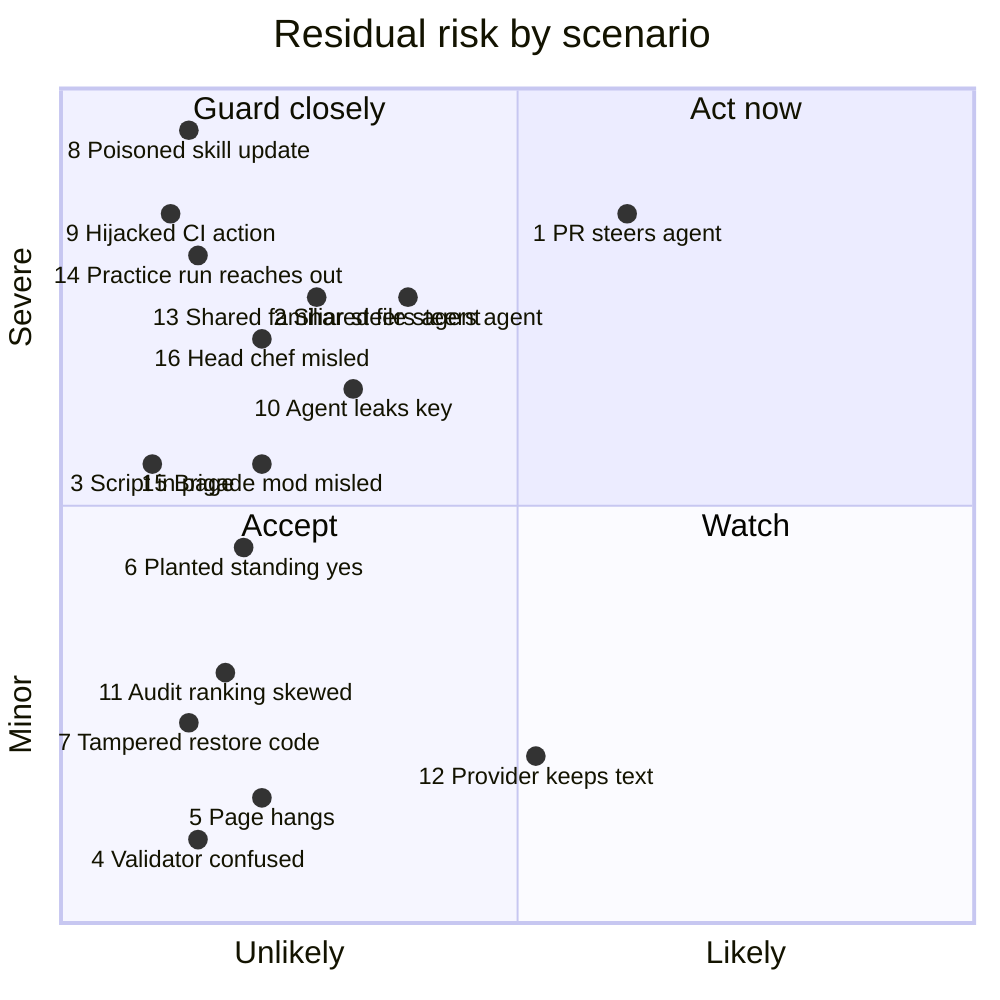

# Threat model

This page lists the attacks worth planning for, what stops each one today, and
what still gets through. Each row is a scenario told from the attacker's side.
The framework labels are tags, so a reader who thinks in STRIDE or MITRE ATLAS
can find their way in. [`SECURITY.md`](../../SECURITY.md) is the summary.

## What an attacker can reach

grimoire runs nothing on a server. An attacker reaches a user through one of
five doors:

1. **A file they wrote** — a box or flightpath file, a skill or agent file
   and its contract, or the pull request, ticket or diff an agent is asked
   to chart.
2. **The skill prose itself** — a change to a `SKILL.md` that reaches every
   installer on the next update.
3. **The CI and publishing path** — the workflows and the actions they run.
4. **The edge audit** — the one script that sends text and a key off the
   machine.
5. **The Brigade mod** — the hooks module Claude Code runs in every session
   that has the plugin, and the text it reads from other sessions.
6. **The head-chef skill's brigade** — the sessions the skill starts, the
   reports and relays they send back, and the worktrees it deletes.

Behind every door the target is the same: **an agent on the user's machine
that obeys text.** The browser page matters too, but it is the smaller prize.

## The lenses, and how they are used

| Lens | What it contributes here |
| --- | --- |
| [STRIDE](https://learn.microsoft.com/en-us/azure/security/develop/threat-modeling-tool-threats) | The kind of harm. Tampering, Information disclosure, Denial of service and Elevation of privilege apply. Spoofing and Repudiation mostly do not, because the project has no accounts or identities. |
| [MITRE ATLAS](https://atlas.mitre.org/) 2026.09 | Attacks on AI systems: prompt injection, poisoned agent tools, supply chain. Case study `AML.CS0049` is a poisoned skill on a skill registry, the closest precedent for this project. |
| [OWASP Top 10 for LLM Applications 2025](https://genai.owasp.org/llm-top-10/) and [for Agentic Applications 2026](https://genai.owasp.org/resource/owasp-top-10-for-agentic-applications-for-2026/) | The common names a reviewer will recognise: `LLM01:2025` prompt injection, `ASI01` agent goal hijack, `ASI04` agentic supply chain. |
| [CSA MAESTRO](https://cloudsecurityalliance.org/blog/2025/02/06/agentic-ai-threat-modeling-framework-maestro) | Only partly. MAESTRO assumes you run the agent stack. grimoire ships content into someone else's agent (layer 3, Agent Frameworks) through a marketplace (layer 7, Agent Ecosystem). Rows give a layer where one fits. |

## Likelihood and impact

The chart places each scenario in [the matrix](#the-matrix) below by its
**residual** risk: what is left after today's guards. The numbers are
judgement, not measurement, and they are here to rank the scenarios, not to
score them.

- **Likelihood** asks how easy the attack is and how often the path occurs. A
  pull request anyone can open scores high. A stolen maintainer token scores low.
- **Impact** asks what the attacker gets. Control of an agent on many machines
  scores highest. A wrong error message scores lowest.

```mermaid
quadrantChart
  title Residual risk by scenario
  x-axis Unlikely --> Likely
  y-axis Minor --> Severe
  quadrant-1 Act now
  quadrant-2 Guard closely
  quadrant-3 Accept
  quadrant-4 Watch
  1 PR steers agent: [0.62, 0.85]
  2 Shared file steers agent: [0.38, 0.75]
  3 Script in page: [0.10, 0.55]
  4 Validator confused: [0.15, 0.10]
  5 Page hangs: [0.22, 0.15]
  6 Planted standing yes: [0.20, 0.45]
  7 Tampered restore code: [0.14, 0.24]
  8 Poisoned skill update: [0.14, 0.95]
  9 Hijacked CI action: [0.12, 0.85]
  10 Agent leaks key: [0.32, 0.64]
  11 Audit ranking skewed: [0.18, 0.30]
  12 Provider keeps text: [0.52, 0.20]
  13 Shared familiar steers agent: [0.28, 0.75]
  14 Practice run reaches out: [0.15, 0.80]
  15 Brigade mod misled: [0.22, 0.55]
  16 Head chef misled: [0.22, 0.70]
```

How to read it:

- **Act now (top right): row 1.** Anyone can open a pull request, and charting
  one is what groundtrack is for. Gap 1 below narrows it most; gap 3's
  reminder narrows it too, but binds no one, so it stays here.
- **Guard closely (top left): rows 2, 13, 16, 8, 14, 9, 10, 15 and 3.** Rarer, but
  severe. Row 2 is row 1's quieter twin, narrowed by the same gap. Row 13 is
  row 2 for the contract skill, plus a seal that can be read as a review.
  Row 16 is row 2 for the head chef, whose agent can start sessions and
  delete worktrees; its guards are prose, and two of git's own refusals.
  Row 8 moved left once the scanners became required checks (gap 2). Row 14
  sits at row 8's likelihood: the skill under test is the owner's own, and
  the tester writes the planted lines. Its guard is hygiene, not a boundary.
  Row 15 moved here from Accept once the mod began writing the roster
  itself: an injection can now reach a silent write that addresses the
  owner, and the race between the mod's check and its write can reach
  another file. Since 0.38.0 a press of Open in app also makes a tool call
  that no permission prompt sees, so the owner's rules over it hold only
  through the mod's own checks.
- **Watch (bottom right): row 12.** It happens by design whenever an account
  has logging on, and the harm is bounded to text the user chose to send.
- **Accept (bottom left): rows 4, 5, 6, 7 and 11.** Row 6 sits nearest the
  middle and gap 1 narrows it.

## The matrix

| # | Scenario | What stops it today | Residual gap | Tags |
| --- | --- | --- | --- | --- |
| 1 | **A pull request steers the agent charting it.** Anyone who can open a pull request or ticket writes text into it that reads as an instruction to the agent. A user asks groundtrack to chart that change. The agent either acts on the text, or draws a clean sheet of a dirty change, and a reviewer trusts the sheet. | The host agent's own rule that file content is data. groundtrack's `SKILL.md` says the material is data to draw, not instructions, and to tell the reader when a line reads as a request. Traces are literals a reader *can* check against the material. When the agent hands the page over, `SKILL.md` now tells it to say that AI drew the page, that it can be wrong, and to check it against the change. On the page, the "authored" stamp in the title block says the same when a reader points at it. | A sentence in a skill and a note on the page remind the agent and the reader. Neither makes anyone check. This is the highest-value attack here. A misleading review aid is the product failing quietly. | `AML.T0051.001` · `LLM01:2025` · `ASI01` · Tampering · MAESTRO 3 |
| 2 | **A shared file speaks to the agent.** A stranger shares a box or flightpath file whose `why`, note or blurb reads as an instruction. The agent opens it, or reads it through the renderer: `--check` prints row names and findings, and `--text` prints blurbs, remarks and tour text verbatim. | The host agent's own rule that file content is data. Both `SKILL.md` files now say a file and the renderer's output are data, not instructions. HTML escaping does nothing here: it guards the browser, not the terminal. | A reminder, not a guard. The renderers' output carries author text back to the agent by design. | `AML.T0051.001` · `LLM01:2025` · `ASI01` · Tampering · MAESTRO 3 |
| 3 | **A shared file runs script in the page.** A stranger crafts a file so its text breaks out into markup when the page renders. | `</` escaped before the script block; `&` and `<` escaped for element content; ids validated; author text never in an attribute. Tests pin the escape's width and put hostile text in every field. See [rendering.md](rendering.md). | "No author text reaches an attribute" is held by review, not by a parse of the page. A new `="${` in a template breaks it. | `LLM05:2025` · Tampering, Elevation of privilege |
| 4 | **A shared file confuses the validator.** A name such as `constructor` collides with `Object.prototype`, so a check silently passes and the author is told the wrong thing is wrong. | `Groundtrack.hardenKeys` and prototype-free maps; tests with bare-name fixtures. | Low. The harm is a wrong diagnosis, not code execution. | Tampering |
| 5 | **A shared file hangs the page.** A box built to branch hard makes the chain walk run for a long time on the reader's machine. A flightpath file built the same way stalls or crashes groundtrack's renderer or page. | eagle-eye stops the walk at 20,000 steps (`skills/eagle-eye/lib/eagle-eye.js`). groundtrack's renderer refuses three shapes before it reads a run: a graph more than 1,000 calls deep, a tree view of more than 20,000 rows, and a search for cut calls that costs more than 1,000,000 units of work. Every other cost measured grows in step with the file. See [row 5, measured](#row-5-measured). | None measured. The two `fold` costs that stalled `--text` and the page are gone (#147). See gap 4. | Denial of service |
| 6 | **Planted text claims a standing yes.** eagle-eye's `SKILL.md` lets the user's instructions give a standing yes for the edge audit. Text in a box or a charted file claims to be that yes, so the audit runs without asking: the box's text leaves the machine and the user's key is charged. | The four facts are still stated before each run. `--dry-run` comes first. `SKILL.md` says a standing yes comes only from the user's own instructions, never from text in a file. | Low. The host agent still has to tell the user's instructions from a file's. | `AML.T0051.001` · `AML.T0034` · `ASI02` · Information disclosure |
| 7 | **A tampered restore code.** Someone edits an exported configuration before the user pastes it back, so the agent updates the box with a set the user never chose. | `SKILL.md` step 8: say the set back in words before acting, and update the box only with what the user confirms. | Low. This is the guard working: the user sees names, not ids. | Tampering |
| 8 | **A poisoned skill update.** An attacker with a stolen maintainer token, or a contributor whose pull request is merged, hides an instruction in a `SKILL.md`. Every installer's agent obeys it after the next update. Since 0.28.0 the change can also be code: the Brigade mod's hooks module, which Claude Code runs in every session that has the plugin, with the session's own rights (row 15). | Pull request required on `main`. `check`, SkillSpector's `scan` and zizmor's `audit` must all pass (required since 2026-09-25). | SkillSpector is static pattern matching: an instruction written to read as ordinary prose can pass it. There is no signing, and the SkillSpector job scans `skills/` only, not the mod: `scripts/check.mjs` holds the mod to its folders, the fixed-path and dependency rules and a version bump, and review does the rest. `npx skills add` copies `main` unless the user pins a commit, and the plugin updates when its version moves and the user updates, by hand or through background auto-update (off by default). A stolen admin account bypasses all of it. | `AML.T0110.000` · `AML.T0115.002` · `AML.T0109` · `LLM03:2025` · `ASI04` · Tampering · MAESTRO 7 |
| 9 | **A hijacked action in CI.** An action's tag is moved to malicious code, which then tampers with the published site or steals the job's token. | Every action pinned to a commit SHA; zizmor's `ref-version-mismatch` checks each SHA against its comment; `persist-credentials: false`; permissions scoped per job. See [scanners.md](scanners.md). | A pin trusts whatever code it names. | `AML.T0010.001` · `LLM03:2025` · Tampering, Elevation of privilege |
| 10 | **The agent is talked into leaking the key.** Planted text asks the agent to print its environment, or to point the audit at an attacker's server. | `audit.mjs` never prints or writes the key. The endpoint override accepts only a loopback address. `SKILL.md` says never to ask for the key or write it to a file. | The script cannot stop the agent itself from printing an environment variable. That boundary belongs to the host agent. | `AML.T0055` · `AML.T0086` · `LLM02:2025` · `ASI03` · Information disclosure |
| 11 | **A box skews the audit's ranking.** Box text is written to push a weak edge down the ranking, so nobody rereads it. | A score never changes an edge's tier. The ranking only orders rereading. | Low and accepted. | `AML.T0051.001` · Tampering |
| 12 | **The provider keeps the text.** After a yes, the box's text sits under the provider's policy, and an OpenRouter account with logging on stores it. | The dry run names every company that receives it. [edge-audit.md](edge-audit.md) states the opt-ins. | Accepted. The repository cannot see or change a provider's policy. | `AML.T0057` · `LLM02:2025` · Information disclosure |
| 13 | **A shared familiar or contract steers the agent, or a seal is read as a review.** A stranger shares a skill or agent file, or the contract it was built from, whose text reads as an instruction. The contract skill reads it in an interview or while amending it, and the agent obeys: it installs the file, widens what the agent may do, or copies an order into the new file. Or a reader sees a valid mark on a shared `SKILL.md` and trusts it as reviewed. | `skills/contract/SKILL.md` says a file, a pasted diff and the check's own output are data, not instructions. Its Step 6 acts on three of the check's warnings only, once each: it fixes `body-length` on the `SKILL.md` it just generated, moving detail into the familiar's `references/`, and `contents` on any reference file in the familiar's folder, without asking, because every file it writes, generates or copies there is its own output to fix, whoever first wrote the text, and that text is still data; and it redrafts in the contract a description not yet Decided that `description-xml` names, and shows the new draft at hand-back. If the warning stays, it stops and asks. It shows and records every other warning and changes nothing for it. An answer drafted from a file for the tools, the actions or a stop needs the person's own words, marked Decided. The skill writes only under `familiars/`, asks before it overwrites a file anywhere else, and never writes a hook, a settings file or a permission list. `skills/contract/scripts/check.mjs` gives its verdict as an exit code, echoes no field value, and cleans every character it echoes. A key the contract does not list fails. The familiar, its contract and every other text file in a skill's folder are "cannot check" if they hold a line or paragraph separator (U+2028, U+2029), a C1 control character (NEL included), a C0 control character other than tab, DEL, U+FFFE, U+FFFF or a lone CR; tab and CRLF line endings are allowed. A Codex agent file (`.toml`) is read through a narrow subset of TOML: top-level `key = value` lines, whole-line comments, and strings that take no escape but `\"` and `\\`. An unquoted `true` or `false` is read only for a key the contract lists. A table such as `[mcp_servers]`, an array, a number, a dotted key, any other escape, a comment after a value, a byte-order mark, a lone CR, or a control character other than tab (DEL included) is "cannot check", on every line, the mark's included. Its known keys are `name`, `description`, `developer_instructions` and `sandbox_mode`; any other key passes only when the contract lists it, and then with any value. The check refuses no value for what it lets the agent do: it warns on every listed setting it does not know to be harmless, with a sharper danger warning for a few settings on a fixed list, and a warning does not fail the check. For a skill only, three more warnings follow Anthropic's Skills docs: a name holding "anthropic" or "claude" (`reserved-name`), a description holding an XML tag (`description-xml`), and a `.md` file over 100 lines, other than the top-level `README.md`, with no Contents heading in its first 30 lines (`contents`). They read only what the check already read, name the rule, never echo the description or the file, and run no regex on a reference file's lines. Its mark is three comment lines at the very end of the file, and any other comment that names a mark key, and a key named like one, is refused. An agent's contract names its target, and the file's ending must match it. The invisible-character rule covers every default-ignorable code point and the bidirectional marks. For a skill, the mark's familiar digest covers every file in the folder but `CONTRACT.md`, so a hand edit to a script or a reference file breaks the seal as an edit to `SKILL.md` does. On every skill folder, sealed or not, the check refuses a link or junction anywhere under it, a name outside `A-Z a-z 0-9 . _ -` or one Windows keeps for a device, a text file that is not UTF-8, holds a NUL or holds a lone CR, and a folder past 256 entries, 8 folders deep, 1 MiB a text file, 4 MiB a font or image or 16 MiB in all; it applies the invisible-character rule to every text file, and names a seal's leftover temporary file rather than skipping it. `--seal` refuses a symlink, a failing file, folder or contract, and a failed write, and then writes nothing; it writes a temporary file beside the familiar and replaces the familiar by a rename, and it adds a line ending to a `.toml` file's last line when that line has none, before the mark. `scripts/check.mjs` runs the check over every skill here. | A valid seal proves that the familiar and its contract have not changed since they were sealed, and nothing about who sealed them: anyone can compute a SHA-256. For a skill, the familiar is every file in its folder but `CONTRACT.md`; an empty folder is not covered. On Windows, a cloud placeholder or another reparse point that is not a link may read as a regular file, and reading it may start a download. That is a hypothesis from the security review, not tested. The `.toml` reader has no reference TOML parser to compare against, because the check takes no dependencies; its subset is kept narrow so that each form it accepts reads the same to TOML. A shipped or shared familiar, and its contract, are reviewed as prose whatever the mark says. In a `.md` or a `.toml` file, a key the contract lists passes with any value. The danger list names known settings only, and every other unknown setting gets the plainer `unreviewed` warning. A file the agent file points to is outside the seal. A stranger who writes both files can widen what the agent may do without asking; a warning is a prompt to read, not a review. The write scope is held by prose and by the person: `--seal` follows a junction or link in a parent folder and writes where it points, and prints the real path so the person can see where the write landed. The data rule is a reminder, as in row 2, and so is Step 6's split between the warnings the skill acts on and the ones it only shows. Every reference file in a familiar's folder counts as the skill's output, whoever wrote it: a file the skill copied there from a person or a stranger, a file that was already there, and the files of a familiar installed outside `familiars/` once the person confirms its path. Step 6 may add a contents list to any of them without a separate ask, and shows it only at hand-back; the text it copied can steer a later agent that loads the familiar. That risk is accepted as the nature of a skill ([ADR 0006](../adr/0006-skills-are-dangerous-by-default.md)); the owner decided it on 2026-10-06. | `AML.T0051.001` · `LLM01:2025` · `ASI01` · `ASI04` · Tampering, Elevation of privilege · MAESTRO 3 |
| 14 | **A skill under test acts outside its practice run.** This is door 2 used on purpose. The practice runner, `scripts/practice.mjs`, starts an agent session that runs a skill under test. The skill, or a line a practice case plants, makes the session act outside its work folder: it changes the owner's live skills or settings, reads a secret, or reaches off the machine. | The runner's posture, which is hygiene, not a boundary ([ADR 0006](../adr/0006-skills-are-dangerous-by-default.md)). The session runs in "don't ask" mode with hooks off. Its settings file denies edits to the copy of the skill under test, to the work folder's project settings, MCP config and instruction files, under `.git` and to `.gitattributes`. It denies reads of the credential file, the user settings files, the global state file, `.ssh`, `.aws`, `.git-credentials`, `.npmrc` and the run's backups. It denies every tool that reaches off the machine or schedules work, and the command line disallows them too. A case's tool rules take four shapes only: a script in the skill under test; one of four git commands: `status`, `diff`, `log` and `show`; a shell read of the home folder or of a test value; and a PowerShell append to the path a test value names inside the work folder. Each is written in every form the skill's own wording gives the command, quoted or bare, with either slash, never a wider one. The append's final wildcard is meant for the line: in #171's probes Claude Code denied every other thing tried there, namely a subexpression, a bracketed or array expression, an environment value, a pipe, an output redirect, and a second command after `;` or on a new line that no rule allows. A provider variable such as `${C:\x}` was not tried. The append path may not name an instruction file or a device. On `clean` and `owner-pact` the session's environment holds no secret by construction, so a read shows only a test value or the home folder. Before each turn the runner refuses a project settings file, an MCP config or an instruction file that setup did not put there, and a copy of the skill under test that changed since start. It backs up and hashes the owner's six live places at start, prints the manifest's hash, lists any change at report, and keeps the backups when one changed. The session's environment is built from a named list. Everything the runner prints or keeps from a session is cleaned and masked. The skill is the owner's own, and the tester writes the planted lines. | **Allowed commands write anywhere they are pointed:** eagle-eye's renderer takes an output path, the contract check seals any folder, and git's `diff`, `log` and `show` take an output file. **Git config runs programs:** git can run a program named in its own configuration. **User settings merge:** on the variants that load user settings, the owner's own allow rules and extra directories merge into the posture, and the settings' environment values, provider keys among them, reach the session, so a case's fake key may be replaced by a real one there, and a read rule then shows the session that value; the report names each such collision, comparing names as the platform does. The owner's extra directories merge in too, and a relative append path follows the session's current folder, so after a `cd` the append can land there. Inside the work folder, #171's probe saw an append from the skill copy's folder under `.claude/` denied. On `full-account`, the user's MCP servers load too, with their own keys and headers. **Reads reach most of the home folder:** the read denies bind the agent's read tools only, not allowed commands, nor shell reads Claude Code does not recognise, such as `grep -r`, and they cover a few named files. A PowerShell provider variable such as `${C:\x}` in the append's wildcard was not tried, and if allowed it would copy a file's content into the work folder. **A secret read can reach a posted result:** masking catches known key shapes and the values the runner holds, of 8 or more characters and other than paths under ordinary names, nothing else. **The checks are evidence, not proof:** they cover only the listed folders, and the backups and start hashes sit where an allowed command could overwrite them, so undo works only if the backup survived. **The run directory holds a backup** of the owner's settings file, without its environment block. **The posture is only a rule check:** it rests on Claude Code's permission rules, and Claude Code has no operating-system sandbox on native Windows. **It also blocks more than a case may want:** Claude Code protects every write under `.claude/` in "don't ask" mode, whatever the allow rules say, so a session cannot edit a companion skill copied there. A case reads an attempted edit from the report's denials, and a case that needs the edit to land is not checkable on the runner. | `ASI02` · `ASI04` · `LLM02:2025` · Tampering, Elevation of privilege, Information disclosure · MAESTRO 3 |
| 15 | **Text another session wrote misleads the Brigade pane, or makes it act.** The plugin ships a mod: a hooks module, `brigade/register.tsx`, that Claude Code runs in every session where grimoire is installed, with the session's own rights. While its pane is open it runs `claude agents --json` every 10 seconds, reads the lead session's roster file every 5, reads other sessions' transcripts to find a link and, for each roster member, the last model call's time and context size for a cache-warmth line on its card, shows the first line of each report another session sends, and shows this session's own rate limits and context at the bottom of the pane, as an SVG image on Desktop, the editor and mobile. Since 0.36.0 it also writes the roster file itself, when the model calls its `set_roster` tool, with no permission prompt. Since 0.38.0, when the owner presses Open in app on a card with a Desktop id, it asks the Desktop app's own tool, `open_session_in` on the server named `ccd_window`, to show that session in a split beside the lead, again with no permission prompt. A planted roster, a session named to match a card, a forged report, or a rate-limit kind a gateway names tries to make the pane run something, open a link the owner did not mean, read a file it should not, or show the owner a false state, a false cache warmth or a false nudge to reply or hand off included. Or a hijacked lead, a planted link or another plugin turns a roster write into a write somewhere else, or into a message to the owner. Or a planted card, another connected server or another plugin turns a press of Open in app into a call the owner's rules do not allow, a call to another tool or server, or a false answer. | **Idle by default:** at session start the mod registers `/brigade` and nothing else, with no timer, process, file read or pane, and a message from another session never opens it. Its reads start on `/brigade` and stop when the pane closes. Its `session.measure` hook does nothing unless the module's own timers run, which only an open pane starts, not plugin state another plugin could set, and it passes the event on unchanged on every path without waiting for the read, so a reading that hung cannot hold up another plugin's hook. Its reads run one at a time, a burst folding into one more, and a reading that started before the pane closed is dropped rather than stored. Its `session.receive` hook keeps a report only while those same timers run, so a flag in plugin state cannot make it keep reports while the pane is closed. The engine drops a pane whose drawing threw without running its close hook, so the roster timer checks every 5 seconds that the pane is still listed, and stops every read when it is not: the reads end within one tick of a close, not at once. **The one write, `set_roster`:** the mod registers the tool only from `/brigade`, and again on a reload (`session.start`) and on a `/clear` or a resume (`classic.SessionStart`) while the pane is open, so a session that never runs `/brigade` carries no tool; the model cannot run `/brigade` itself, and a message from another session whose text is `/brigade` opens nothing (measured on 2.1.292). The engine cannot take a tool away, so after the pane closes the tool stays listed, and at each call the handler asks the engine for the open panes and refuses with "pane closed; roster not kept". It refuses a call that carries a subagent id. It strips only the engine's own fields from the call and passes the rest as text to the shared roster check in `brigade/roster.ts`, whose allow-list refuses any unknown key, `__proto__` and `constructor` included; both lists are required, and the checked roster is serialized and measured against the same 256 KiB cap the pane reads by. It asks the engine's verdict (`$.tool.check`, which runs nothing) and refuses any `deny`, an `ask` that names a rule, and an organisation ceiling below `allow`; it adds no `tool.check` hook of its own. It reads the permission mode each prompt and each other tool call carries, and refuses in plan and don't-ask modes, again just before the write. A call whose dispatch was abandoned while it waited its turn, because it ran out of time or the owner interrupted it, writes nothing. The model never names a path: the file is the session's own id under the plugin's data folder, built from the config folder alone. Before each write, and each pane read, the path rule walks every folder from the config folder down with `stat` alone, never `exists`, which follows links: it refuses any folder or file that is a link, broken or not, or not of its kind, any `stat` that fails other than as missing, and any folder whose real path is not the config folder's real path joined with the same names, the decisive control, since `isLink` was measured only for junctions and file links. `plugins` must exist; the write may create `data`, the plugin's folder and `brigade`. An existing file is overwritten only if it passes the strict roster check, so a hard link to another file, even one holding `{}`, is refused, and that refusal does not echo what the file holds. After the write the same path rule runs again, over every folder and the file, and if any of them became a link the owner is told in the pane and a toast, and the model is told the roster may or may not have been kept. Writes run one at a time. The pane's state changes only after a write succeeds. A throw inside the handler becomes a refusal in code, which says "unchanged" only when the write had not begun, and the registration's `.catch` answers for a throw, an overrun or a wrong shape; the handler never passes the call on. The tests that hold this run under `claude plugin test`, with `stat` answers taken from a recording of the real engine's answers on real links (`scripts/record-brigade-stats.mjs`), and the pure rules run in the repository's own suite. **Usage:** this session's own, read with `$.session.usage()` when the pane opens and in that hook, never in a render. The context breakdown is asked for only when the session draws on a surface other than the terminal, and only as `summary`, the local estimate, never `full`, which counts with the token-count API; a test fails on that word as a string in the view and register modules. The stored snapshot holds only what the view draws, each field checked and capped: each rate limit's kind, percent and reset time, the context's percent, tokens and window, and each breakdown row's name, kind and tokens. No memory-file path is kept, since plugin state is readable by other plugins. The view checks the stored snapshot again by the same rules before it draws, since the engine lets another plugin rewrite a value as it is set. **Where it reads:** the roster file is named by the engine's own session id, held to the engine's id shape, in the plugin's data folder, the folder the plugin-manifest reference names `${CLAUDE_PLUGIN_DATA}`, built by the reference's rule under the config folder that the install location or the engine's session-start transcript path names. The variable itself is never read: a mod's environment usually lacks it, and another plugin can set it. With no config folder, the pane shows an error naming the expected file, reads no file and runs no process, and the tool refuses. The pane reads the file only where the path rule above allows, so it follows no link either. No fixed path. **What it accepts:** the roster is refused with an error in the pane unless every field is text within its cap, the status is one of four words, no title repeats once hidden characters go, no to-do id repeats and no field is unknown; at most 50 cards and 50 to-dos, and a file over 256 KiB is not read. Lookups go through `Map`s, so a title such as `constructor` reaches no prototype. **To-dos:** a press ticks a to-do and a second press within 30 seconds undoes it; the roster timer's sweep then moves it to done. The ticks are plugin state, so `brigade/view.ts` checks them again before every use: names must be text within the stored cap, a repeat or anything past 50 is dropped, and a time that is not a number, or is more than the grace period ahead of the clock, counts as due, so a planted time can only end a tick sooner, never keep a to-do crossed out for good. The done list is checked too: only its text entries count. The sweep works out its due ids inside the update that writes the ticks, so an undo that lands mid-sweep is not lost to a stale read, and it drops a tick whose to-do left the roster only after a roster load that succeeded: a missing file, a failed check or a file it cannot name leaves every tick as it was. **How it shows text:** every string is drawn as text, never as Markdown or a link, with control characters, every default-ignorable code point and the bidirectional marks removed before it is cut to one line. **The usage image:** built as a string in `brigade/view.ts`. Every text in it, rate-limit kinds and category names included, goes through that same cleaner, then has lone surrogates, U+FFFE and U+FFFF removed, then the XML escape of `& < > " '`. Attribute values are only numbers the module computed, checked finite and clamped, and class names from a fixed set; the clip path's id is fixed. A test reads every attribute of the built image back against that allowlist, with hostile text in every field, and fails when a tag holds an attribute it could not read. An image over the engine's 131,072-character cap falls back to the text bars, and the legend lists at most 12 rows. Rate-limit kinds are looked up in a `Map`, so `constructor` draws as text. **Transcripts:** read only for a roster member, by a session id `claude agents --json` printed in the engine's shape. A row's live state is its `status`, or a background row's `state`, cleaned and cut to 20 characters. For the link, a transcript is read once per session, a miss remembered too, and the link is taken only from the row Claude Code writes when Remote Control starts (a system row of subtype `bridge_status`), so a link quoted in a brief or a relayed message is never read. For warmth, `brigade/view.ts` decides each read, under its tests: a transcript is re-read only when its modified time differs from the last read that succeeded, kept in a `Map` keyed by the transcript's path and set only after a read and a parse that succeeded, so a failed read is tried again; never while the member is working (`busy`, `running` or `working`), so a working member with no known call shows "warm (working)" with no size, from the stat and its last read, with no new read; only a path that stats as a regular file, the file itself not a link, of at most 4 MiB, the engine's read cap. A larger transcript is not read, and its card says its warmth is unknown: never a guess from the file's modified time, which is never older than the last call. A name that two rows carry is read for warmth for neither, and its card says two sessions share it; the link read does not check this. The agents poll runs one at a time, a tick that finds one running doing nothing, and a poll that the pane's close overtakes reads no further transcript and stores no warmth, and a link read it overtakes records nothing, so the next open reads it again. Only a real model call counts: a row with the `<synthetic>` model, the API-error flag, the sidechain flag or no context at all is skipped; its time must be ISO UTC ending in `Z` and no later than the file's modified time plus 2 minutes; each token count must be absent or a whole number from 0 to 10,000,000. The cache window is taken only from a call that wrote cache; with none, the card shows no countdown and no nudge. The stored warmth records are checked again before they are drawn, by kind, number and size. **Open in app, the tool route:** only a card whose Desktop id passes the `local_` shape check, the same check the link uses, tries it; a background card or a Remote Control link never does. One press at a time per Desktop id: a second press for an id whose tool route is still running is ignored, with no call and no toast, and the card's button and its to-do's Open share the mark, which clears when the route ends by any path. The mod first asks where the session is drawn (`$.session.surfaces()`) and goes on only where the Desktop app draws it, since elsewhere the app's server is absent and a server of the same name would be the only one to answer. It then asks `$.tool.list()` and goes on only when it lists a tool named exactly `mcp__ccd_window__open_session_in`, the name the owner's rules are matched on. It then asks the engine's verdict for that name with the call's input (`$.tool.check`), and goes on only on `allow` or an `ask` that names no rule, which is a mode's; a `deny`, an `ask` naming a rule, an organisation ceiling below `allow` or any other answer skips the tool. The server, the tool and the target (`split`) are constants in the mod; the checked Desktop id is the only roster text the call carries. The whole tool route, the tool list and the verdict included, is bounded at 5 seconds on the engine's clock; past that it makes no call and shows nothing, so a question that never comes back cannot hold the one-press mark. It reads the answer as untrusted, with exactly three outcomes: `isError` strictly `false` and `content` a list whose first block is text toasts that text's first line, cleaned and cut to 200 characters by the pane's one-line rule; `isError` strictly `false` and `content` a list with no such block toasts a fixed "Opened in the app."; anything else goes to the link route, and an `isError` of `true` with a text block first toasts "The app did not open it: " and that text, cleaned and cut the same way. Any rejection or throw in the tool route, the wait included, goes to the link route; nothing in it throws out of the press. The rules are pure functions in `brigade/roster.ts`, tested in the repository's own suite, and the press is tested under `claude plugin test` with the tool list, verdict, call and processes answered by the test. **Open in app, the link route,** unchanged: passes `explorer.exe` one argument with no shell: a `claude://` link of two shapes, built from a checked id. Both programs are found on the system path, not in the project folder: a session in a folder holding a stub `claude.exe` and `explorer.exe` still ran the real ones (2.1.289, Windows). **The check:** `scripts/check.mjs` holds `hooks/hooks.json`, the module it names, every quoted `./` or `../` path (either slash) in the mod's code on any line, and the manifest's `types` inside `brigade/` and `hooks/`, under the fixed-path and dependency rules and the version bump. It refuses an absolute import path on an import line it reads, and a mod folder or hooks file spelled in another case. | **The roster write has no review:** it skips Claude Code's permission step, so no human and no classifier sees it; every call is still recorded in the transcript as the tool's result. **What stops it, and what does not:** a deny rule for `mcp__grimoire__set_roster` (exact, server-wide or wildcard) removes the tool from the session, and a managed deny is refused too. The owner's own hooks never see the call. Plan and don't-ask modes refuse it, read from the mode each prompt and each other tool call carries, which the build found readable on 2.1.292 in headless runs; restricted and auto modes do not, by choice, since the roster is a view the owner asked for. The mode is unknown after a reload, a clear or a resume until the next prompt or tool call, and an unknown mode refuses nothing, since refusing it would end the roster after every resume; a switch to plan made during a turn is not seen until the next report. **What a hijacked lead can write:** within the caps, text addressed to the owner under "Waiting on you", or a card's "Open in app" aimed at another of the owner's sessions. **The check-and-write race, at its worst:** the engine offers no atomic or no-follow write, so a program running as the owner, a hijacked lead's own shell included, can swap the roster file for a link between the check and the write, and one roster write then overwrites the link's target. On Windows a hard link needs no special rights, and the owner's settings file is a same-volume target, so the race could erase the owner's deny rules. The model can call the tool again and again to retry the race. The `stat` after the write catches a swapped link after the fact, not a hard link. **Hard links:** a hard link between two roster-shaped files is not detected, so one roster can overwrite another. **A roster cut short:** a write the engine cut short leaves a file the strict check refuses to overwrite, so the owner deletes it by hand; a pane read that lands mid-write shows one error until the next read. **A write that never returns** holds the queue, so every later call runs out of time until the module reloads. **Linked folders:** an install that moved `plugins`, `data`, the plugin's folder or `brigade` to another drive with a junction or link loses its pane and its tool: the pane says the roster path must not pass through a link, and the folder has to move back. The config folder itself may be a link. **Measured on Windows only:** the link answers the tests rest on were recorded on Windows; macOS and Linux answers are written by hand from the engine's declarations, and the recorder runs on Windows only. **Other plugins:** their hooks, `tool.check` verdicts included, can see, rewrite or deny this write, or approve it over the owner's ask rule, since the last word wins; another plugin's `ask` that names no rule is read as a mode's and ignored. That is the trust they already have, and another plugin's call is no new capability, since plugins can already write files. **The tests model the engine:** `claude plugin test` gives a plugin no file system, so the link cases run against `stat` answers recorded from the real engine on real links; an engine update that changes those answers is caught only when someone runs the recorder again. **A report's sender is a claim:** the name comes from the wrapper Claude Code puts round a message, so a session can sign a report with another card's title. The pane shows it as text, and the record of the work is wherever the owner's process keeps it, not the pane. **A name can be borrowed:** a session named like a card has its transcript read for a link and for warmth, and its live state shown on that card, so it can show that card a false warmth line or nudge, a hand-off suggestion included. A name two sessions carry at once reads unknown for warmth, which narrows this; a lone impostor is not caught. **A transcript is written by its session:** its numbers are checked for shape and size, not for truth, so a session can misstate its own context size or last-call time, and so its own warmth line and nudge. **Roster text is shown as written,** within its caps: a head chef talked into writing a false phase shows it. **The pane's own state is not private:** another plugin can rewrite the ticks and the done list, and so tick, untick or clear a to-do from the pane, or the warmth records, and so show a false warmth line or nudge; the checks keep that from throwing or reaching a prototype, not from happening. The rest of its stored state, the roster, the dismissed cards, the reports, the live states, the links and the file names, is drawn as stored; another plugin that rewrites one into the wrong shape makes the drawing throw, and the pane then closes itself within one roster tick. **The pane list is the engine's answer:** a plugin whose hooks sit above grimoire's can answer `$.ui.panes()` for it, and so keep the reads running after the pane is gone, or arm the mod with no pane at session start, or offer `set_roster` and let it write while the pane is closed; an answer that never comes leaves the reads running too. That plugin already runs with the session's rights. **The data folder's name can differ from Claude Code's:** a plugin loaded from a marketplace added from a local folder runs from that folder, so the mod cannot read the marketplace's name and uses `grimoire-inline`, which can differ from the data folder Claude Code made for the plugin. The mod still reads and writes the same folder, so the pane works, but an uninstall may leave that folder behind. **Open in app's tool call has no review:** it skips Claude Code's permission prompt, and the owner's own hooks and the auto-mode classifier never see it; it is probably not recorded in the transcript. **Rules over it hold only through the mod:** a deny or ask rule for `mcp__ccd_window__open_session_in`, exact or server-wide, holds only because the mod asks the verdict first. An exact deny rule was seen to stop the split on Desktop 2.1.289; the server-wide form, `mcp__ccd_window`, rests on the engine matching it the same way, and was not tried there. The organisation ceiling binds only where the engine reports one, and the 2.1.289 engine Desktop runs declares none on a verdict, for this call and for `set_roster` alike. **No mode refusal,** by choice: unlike `set_roster`, the mod adds no refusal of its own in plan and don't-ask modes, since it is the owner's own press, writes nothing and only arranges the window. The engine's verdict for the mode still applies, and a deny verdict skips the tool. **The server is found by name:** another connected server that answers to `ccd_window` would receive the session id and the moment of the press, could answer in the app's place and so stop the link route, and could put one cleaned line of its own in the success toast. Such a server could come from the owner's own MCP settings, a project's approved MCP settings or a plugin, could run on another machine, and may also be one whose name only spells as `ccd_window` in tool names. The mod tries the tool only where the Desktop app draws the session, so in the terminal, where the app's server is absent, no such server is called; inside Desktop the surface gate and the tool-list gate narrow this and do not close it. **Other plugins:** their hooks can answer the tool list, the verdict or the call, rewrite the call's server, tool or arguments, or press the button. That is the trust they already have. **A hijacked lead and the tool route:** a card aimed at another session the lead started only arranges the window; the link route still opens any Desktop session whose id the card names, as before. **A late answer** can show the split after the 5-second wait has sent the press to the link route, so the owner may see both. **Open in app is Windows only on the link route:** the tool route works wherever Desktop runs; the link route goes through Windows' handler for `claude://`, and does nothing elsewhere; macOS is left for a later issue. **The check reads text:** it reads paths as written, so a string spelled with escapes or continued across lines is not seen; review reads the diff for those, as for a computed path. **The usage image's attributes are held by its tests:** "no outside text in an attribute" holds for the image's one builder and the cases its test builds, as in row 3; a new attribute written from outside text would break it, and review reads the diff for that. **Usage figures are the engine's:** they are shown as the engine reports them, and a gateway's rate-limit kind is its own text, cleaned and cut to 30 characters. **No sandbox:** the module runs with the session's rights. What bounds it is review, the check and the version bump, which is row 8's guard. | `AML.T0051.001` · `LLM01:2025` · `ASI04` · Tampering, Information disclosure, Elevation of privilege · MAESTRO 3 |
| 16 | **Text from another session talks the head chef into acting, or a stranger's text reaches its shell.** The `head-chef` skill starts agent sessions with `claude --bg --remote-control`, sends them messages, reads their reports and relays between them, keeps the Brigade roster by calling the mod's `set_roster` tool, and on the owner's "done" stops a session and deletes its worktree and branch. A report, a relayed line, an issue a session was pointed at, or a roster line tries to make it start or stop a session, delete the wrong folder or unsaved work, run text in a shell, or act as if the owner had said yes. Since 0.3.0 the head chef also reads its own name before it writes, tells live sessions a new one, and reads its live sessions' records, and its briefs tell each session how to find a renamed lead: a forged rename note or rename message, a report aimed at an old name, or a stranger's comment on a public record tries to redirect a report, steer the lead through a record, or put the lead's session id on a record. Since 0.4.0 a session may take the owner's answer to its own question by relay: a forged relayed answer, a stale one, a bad relay sent to stall sessions or flood their records, or quoted words that reach beyond the chosen letter try to move a session as if the owner had answered, or to put a code on a record. Since 0.4.0 as amended for the relay scripts, two scripts in the skill's folder run those checks: a planted transcript record, rewritten relay state, a model's changed copy of a message, or a program planted in a working folder tries to pass a forged answer or run with the owner's rights. | `skills/head-chef/SKILL.md` and its scripts `scripts/relay-lead.mjs` and `scripts/relay-session.mjs`, sealed and scanned with the other skills, the scripts tested by `tests/relay-*.test.mjs`. **The owner's yes:** only the owner's own words in chat count; starting, stopping, `claude rm` and deleting a worktree each need them; a message from another session, a report, a brief, a roster line or an issue comment never counts. **Data, not instructions:** reports and relayed text are data; a line that reads as a request is told to the owner, not followed; a relay is quoted with its source session named. **The shell:** the start prompt is a fixed-form pointer to where the brief lives, never task text or a title, passed as a single-quoted here-string; the head chef writes each session name from a safe set of characters, never from an issue. **The roster:** the head chef writes no file; the mod writes the roster on its `set_roster` call, under row 15's guards. With no tool, or a pane-closed refusal, it keeps no roster. It calls once more only after a shape, size or malformed-input refusal, all three made before the mod touches any file, and any other refusal, or a second one, ends the roster for the session and goes to the owner. So a lead that follows the skill does not retry after a refusal that could signal tampering; each roster update is still one write that row 15's race applies to. **Cleanup:** the worktree comes only from `git worktree list --porcelain` run in the lead session's own repository, as the entry equal to the session's working folder from `claude agents --json`, never from roster or message text; it is never the main working tree; its git common dir must be the lead repository's and its git dir must sit in that common dir's `worktrees` folder, so a `.git` file the session rewrote to point at a planted folder is refused, also one whose `commondir` names the lead's; every git command that reads the folder, removal included, runs with `core.fsmonitor` off; cleanup stops when the lead cannot find its own session row; cleanup refuses when another live session works inside it, and on uncommitted or untracked files, commits reachable from no remote-tracking ref, or stash entries for its branch; it never pops or drops a stash; it names the session and the absolute path back, acts only on the owner's confirming words, and runs its checks again after them; a path, a branch and an id must be plain characters before they reach a command; it removes with no flag that forces or discards. `git worktree remove` then refuses a folder with an untracked file and `git branch -d` an unmerged branch, both seen in #185; `claude rm`'s refusal of unpushed commits is read from its help and not yet seen. In #185 the commands each refusal reads were run in a scratch repository by a script, and each printed what its refusal needs; a planted `.git` file was reproduced there, with and without a `commondir` naming the lead's, and the two git-dir checks refused both; `core.fsmonitor` set in the shared config ran its program during `git worktree remove` without the flag and not with it. No agent has yet followed the prose through a cleanup. **Reports after a rename (0.3.0):** the start prompt names the lead by name and session id; a brief tells the session to find the lead by that id before each report, and to fall back only to the newest name the head chef gave, a rename line on the record counting only from the owner's account; a failed send gets one more try, then a fixed miss line that holds no report text, error, path or id, and the next milestone tries again. The head chef reads its own name before each brief, start prompt and hand-off, tells the owner which records a rename note will reach and which are public, counting an unreadable one as public, and posts only the fixed rename line, with the name in a code span, after it checks the name (one line, at most 80 characters, no quote mark, no backtick), counting any repository that is not private as public. **The record check:** once per turn it compares its live sessions' rows in `claude agents --json`; it reads an issue record where a row moved, even when the report came by message, through a read that filters by author inside the command before it takes the owner's account's last 20 entries, each cut to 2,000 characters, so other accounts' entries come back as one count with the newest author and time, and a flood of them cannot hide a milestone; a failed call to the record's tool reads nothing else, never reads without the filter, and is told to the owner once; a `done` session that left no report is told to the owner; an owner's-account milestone that never arrived is handled as that report, as data. **The record tool's four uses:** read a live session's record, read its repository's visibility, read the signed-in account's name alone, and post the rename line; it never closes, edits, deletes, labels or merges. **No id on a record:** the lead's session id goes only in start prompts, the wait line and messages that are not a brief, never in a brief, even one sent as a message, nor on a record, a roster card or a to-do; a session finds the lead by a read filtered to the lead's name alone, and trusts a rename line only from the account its own record tool is signed in as; every post goes through a file or a single-quoted here-string, and free text only through a file. **Relayed answers (0.4.0):** the start prompt, not the record, holds the floor: a message from the lead counts as an answer from the owner only with the code of a question the session sent and one of the choices it offered, and then only the chosen letter is acted on; never for a merge or other publish, a deletion, a permission or settings change, starting or stopping a session, or the local-only answers, which the head chef takes only from the owner's request or own instructions, held to one line of plain characters; a local-only list only grows, and only by entries from the owner's account. A session asks with an 8-hex code from a secure source (a version 4 GUID or a secure generator, never made up), sent only to the lead found by session id, with no code on the record; with no secure source or no single lead row, it asks in its own chat. It runs its checks in order, and the first failure decides; it takes a relay only when the sender's shown name maps to the lead's session id alone, its code is open and still in view, its letter's words match its own, and the answer is not kept local; any answer closes the code; it acts on the chosen letter alone, and posts the owner's words in a fence longer than any backtick run, from a file written with the file tool, never through a here-string whose closing mark the words could hold; the file sits in the system's temporary folder and is deleted after the post. A question on the record holds no local path, error text, secret or session id. A failed check takes nothing, posts and tells at most once per code with no code on the record, then a fixed count line, closes a matched code once, and never on a check 1 or 2 failure, and asks again once, then moves the question to the session's own chat, and never stalls the session. The head chef notes each session's id at launch (a chip only by Desktop's own id or exactly one new row), takes a question only from a sender whose name no other session holds, allows one question per code, relays nothing when two questions share one, and relays only to a question still in its context, shows the choices word for word with the quote notice and whether the record is public, relays only the owner's own words by the noted session id, and only when no other session holds that name, never its own choice, and keeps a list of relays sent, matched by code and session: it tells the owner at once of an answer taken that it never relayed, naming the record to correct, a different letter, or any refused relay; it names a code it never noted once per turn, and a relay that got no reply. Cards and to-dos hold no code. **The relay scripts (0.4.0 amended):** the checks above run in the scripts, not in prose; every message carries a digest line (12 hex of SHA-256 of the text above it), so a model's changed copy is refused; the scripts read messages and the owner's words only from the caller's own transcript, by the sender and text fields the message system recorded and the typed record's measured shape, never retyped and never from a tool result, a file or a record entry; order is file position, never a timestamp; the start prompt comes only from the transcript's head; each model keeps its memory checks (the session acts only on a question it asked and still sees, applies its own floor and local-only list, and replies only to the lead its start prompt names; the head chef compares the owner line with what it saw the owner type before each send, and raises the never-relayed alarm for a matched take it does not remember relaying); the cross-check reads the taken and failed-check lines on each noted record as well as the replies, prints every take it matched, and alarms on an edited line or an unreadable record; no shell, and `gh` and `claude` only from an absolute path, never the working folder, nothing typed or received as an argument; any input that cannot be read with certainty ends in asking in the session's own chat; the screens (floor words, local-only answers, hex runs, ids, paths, tokens) back up each model's judgement, never replace it; a compaction or a clear closes every open question; state is written whole through a rename, one run at a time under a lock, a closed code deleted, `end` and orphan cleanup removing files; relays run only in auto mode, so no session stalls on a prompt. | **It is prose, except the relay checks.** Every guard above but the relay scripts' is an instruction the host agent follows; nothing runs it, and an agent that ignores the skill can run any command, the scripts included or skipped. Row 8 guards the text, not the agent. **Remote Control:** `--remote-control` makes each background session drivable from any device signed in to the owner's account. The skill says so the first time it starts one. **The owner's default permission mode carries over:** a session runs in the owner's default mode unless the owner names one, so a permissive default reaches every session started unattended. **Usage:** each launch spends plan usage; the owner's request is the yes. **Ignored files go with the folder:** the checks read changed and untracked files, not files git ignores. **A sender is a claim:** a session can sign a message with another's name, and a forged report is still data, never a yes, so no check rests on the sender's name alone: check 1 maps the shown name to the lead's session id, and holds only when no other session has that name; the comparison is made as text against a listing of names and session ids, so no name taken from a message reaches a command. **The path comparison is the agent's:** it reads and compares paths itself, with no script. **A session reads what it is pointed at:** the issue in its brief is rows 1 and 2's door for that session. **A Desktop chip** is closed by the owner, not by a command. **Git config still runs programs:** the lead repository's own config, and a worktree's `config.worktree` inside it, are files a session can write, and git can run a program they name; turning `core.fsmonitor` off covers that setting only, and a filter driver that the worktree's `.gitattributes` names and that config defines can still run while git reads or removes the folder. **Curly quotes:** PowerShell reads `‘ ’ ‚ ‛` as quote marks; the character sets hold paths, branches and ids, and the agent applies them. **Time between check and removal:** the checks run again after the owner's yes, but a session that is not stopped, or a chip the owner left open, can still change the folder in between. **The owner's account is every session's account:** the author filter keeps out strangers, not the owner's own sessions, so any session can post a milestone-shaped entry or a rename line that counts as the owner's. **A forged rename message can redirect a report:** when no row holds the lead's session id, a session sends its report to the newest name given, so a session that forges a rename message gets one report's text, which stays data there. **Where the new data lives:** the lead's session id sits in each start prompt, so in each session's transcript; with Remote Control on, transcripts can be seen from every device signed in to the owner's account. The lead's name, report lines and miss lines go on records, which may be public. **A post cannot be taken back:** an edit or a deletion later leaves the old text in the comment's edit history and in the notification email, so a session id posted once stays readable there. **An edited comment keeps its author:** an account with write access to the repository can edit a comment by the owner's account, which then passes the author filter. **Text laundered through a session:** a session that reads a stranger's comment can be steered into reposting it under the owner's account, where the lead's author filter passes it as data. **A chip's wait looks idle:** an interactive row carries no `state`, so the lead sees a chip waiting in its own chat only as idle, and the idle notice then rests on its record. **The code is secret from text, not from a program:** any session can read another's transcript on disk, and a code sits in two of them; a session that reads it can still only pick one of the asking session's own choices, inside the floor, and the lead's cross-check shows the owner a taken answer it never sent. **Any local session with a shell can write a start prompt:** the head chef writes its sessions' start prompts in the pointer form, but nothing stops another session launching one of its own. **A relayed answer is only as true as the head chef's reading of its own chat.** **Where the relay's data lives:** a code sits in the asking session's and the lead's transcripts, which Remote Control lets every device signed in to the owner's account see; the owner's exact words, the questions, the taken-answer lines and the failed-check lines go on records, which may be public; the pane keeps each message's first line, which holds no code, and the roster holds no code. Transcripts are unencrypted at rest unless the disk is; a closed code grants nothing. **Check 1 trusts the sender the message system shows:** whether a peer can forge it is not known; the code and the choice checks still hold if it can. **The lead's alarms are untested in a brigade:** the field trial on issue 218 saw the refusals, but a forged relay was refused before the never-relayed alarm could fire. **A chip with no Desktop id** can be noted as a session that takes its name after launch, before its own row shows; a chip's first prompt carries the lead's session id and takes its start prompt only from that session. **A rename between lookup and send:** the lead finds the asker by session id but sends by name, so a rename in that moment could route one relay, with its code and the owner's words, to another session; the asker's next report then shows no reply. **A code is forwarded only in its own shape:** a relay's code line reaches the lead, and the owner, only when it is 8 lowercase hex characters. **Files are not witnesses (0.4.0 amended):** relay state and transcripts can be read and rewritten by any session of the same user, which can invent a question's choices, add a relay to the lead's list of relays sent, rewrite a start prompt or empty its local-only list; the models' memory checks are the guard. Any session can edit or delete a record line as the owner's account, so the record cross-check holds only while none does, and `check` alarms on an edited line. On Desktop, typed text is recognised by the app's `sdk` prompt source, which shows the text came through the app, not that the owner typed it; another session can start a new session with a prompt of that shape; the head chef's comparison is the guard, and the owner accepted this, 2026-10-08. The owner sees a model's copy of the scripts' output, and the head chef's comparison is itself a model step. The transcript format is undocumented: a change fails closed, and relays stop until the scripts are updated. A script holds a transcript's head and tail in memory while it runs, though it prints only what it handles. The script path in a start prompt can go stale after a plugin update; the session then asks in its own chat. **Where the relay scripts' data lives:** relay state in `plugins/data/grimoire-relay/` under the config folder, one file per session id (each open question's code, question, choices, record link and entry, failure count, the handled record ids; for the lead, the noted session ids with their records, a chip snapshot as hashes only, each question's code, asker, arrival and mark, the relays sent and the matched takes), never the owner's words, deleted as above; the head chef's local-only list file before a launch; the session's question file and the scripts' own post files, each deleted after use; both transcripts, which hold every code, the start prompt and the owner's words, and which Remote Control shows on every device signed in to the owner's account. | `AML.T0051.001` · `LLM01:2025` · `ASI01` · `ASI02` · Tampering, Elevation of privilege, Information disclosure · MAESTRO 3 |

## Row 15, the engine calls behind its write and its tool call

The page's rule below asks for a row for each new call the mod makes through
`$`. These are the calls `set_roster` added in 0.36.0, and the calls Open in
app's tool route added in 0.38.0, with what each one is trusted for and what
bounds it.

| Call | What the mod uses it for | What bounds it |
| --- | --- | --- |
| `$.tool.register` | Offers `set_roster` to the model, from `/brigade`, and again on a reload, a `/clear` or a resume while the pane is open. | Registered only where the engine lists the pane open, and only the owner or another plugin can open it. The engine cannot unregister a tool, so the handler checks the pane at every call. |
| `$.tool.check` | Asks the engine's verdict for the call before writing, and refuses a `deny` or an `ask` that names a rule. Since 0.38.0 it also asks the verdict for `mcp__ccd_window__open_session_in` before Open in app calls it, and skips the tool on a `deny`, an `ask` that names a rule, or any answer it cannot read. Both uses also refuse an organisation ceiling below `allow`. | It runs no tool and opens no dialog. Another plugin's `tool.check` hook can change the verdict, as row 15 says. The ceiling binds only where the engine reports one; the 2.1.289 engine declares none on a verdict. |
| `$.session.surfaces` | Already read for the usage image. Since 0.38.0 it also tells Open in app whether the Desktop app draws the session, before anything else in the tool route. | The engine's own answer; another plugin can answer it, as for the verdict. A wrong answer only moves the press to the link route, or lets the two checks below run. |
| `$.tool.list` | Tells Open in app whether the engine lists the Desktop app's tool by exactly `mcp__ccd_window__open_session_in`, before it asks the verdict or calls. | Read as untrusted: only a list whose entry's name is that exact string counts. Another plugin can answer it, as for the verdict. |
| `$.mcp.call` | Calls `open_session_in` on the server named `ccd_window`, with the card's checked Desktop id and the target `split`, when the owner presses Open in app and both checks above passed. | The server, the tool and the target are constants; only the checked id comes from the roster. It skips the permission prompt, so the two checks stand in for one. The whole route, from the tool list to the answer, is bounded at 5 seconds on the engine's clock, one press at a time per id, and the answer is read as untrusted. The server is found by name, so another server answering to `ccd_window` would receive the id, as row 15 says. |
| `$.fs.write` | Writes the roster file. | Only to the path the mod builds from the config folder and the session id, only after the path rule allows it and the roster passed the shared check and cap, one write at a time. The engine's write follows links, which the path rule and the `stat` after the write are there for; the race between them is row 15's worst case. |
| `$.ui.panes` | Tells the handler, at each call, whether the Brigade pane is open. | The engine's own record, never the mod's flag. A plugin above grimoire can answer it, which row 15 already names. |
| `$.fs.stat` with `resolve` | Every `stat` of the path rule, for the writer and the pane alike. | Read for `isLink`, `kind` and `realPath` only, and a rejection counts as missing only when its message ends in ENOENT. |

## Row 5, measured

**The renderer's three commands finish in under 1.5 s on every file measured,
up to 25 MB, that passes the three limits.** The target is 3 s for each of `--check`, `--out` and `--text`. The
page's first draw is not held to that target. A page of 20,000 separate boxes
takes about 6 s, and nearly all of it is the browser building the boxes.

All numbers were measured with `fold` sharing its tables between moves (#145).
Each file below is the worst one measured that passes every limit, for the
cost it drives.

| Cost it drives | Worst passing file | `--check` | `--out` | `--text` | Page, first draw |
| --- | --- | --- | --- | --- | --- |
| Call depth (limit 1,000 calls) | A chain of 1,001 nodes, 1,000 calls deep (0.25 MB) | 0.09 s | 0.12 s | 0.08 s | 0.41 s |
| Tree rows (limit 20,000) | An entry that calls 19,999 separate nodes, and a run that enters each one (6.5 MB) | 0.38 s | 0.41 s | 0.56 s | 6.4 s |
| Tree rows, long chains | A 999-node chain whose last node calls a leaf from 19,001 sites, ids of 16 characters (1.07 MB) | 0.11 s | 0.12 s | 0.40 s | 0.66 s |
| Search for cut calls (limit 1,000,000) | 11 layers that each rename `{`, `}` and `{}`, over 10,000 calls with no arguments: 990,000 units and 330,000 cuts (0.30 MB) | 0.74 s | 0.76 s | 0.25 s | 1.1 s |
| The error-tag finding | A chain of 20,000 nodes that no entry reaches, each declaring a tag (4.9 MB) | 0.27 s | 0.29 s | 0.23 s | 0.21 s |
| Tour stops and graphs | 30,000 graphs and 30,000 tour stops (7.4 MB) | 0.40 s | 0.43 s | 0.55 s | 0.61 s |
| Tour stops and runs | 30,000 runs and 30,000 tour stops (4.9 MB) | 0.37 s | 0.38 s | 0.40 s | 0.35 s |
| Node id length (no limit) | The long-chain file above, with ids of 1,000 characters (22.7 MB) | 0.17 s | 0.23 s | 0.52 s | 0.87 s |
| For comparison | `docs/examples/pr-382.flightpath.json` (7 graphs, 88 nodes) | 0.11 s | 0.11 s | 0.16 s | 0.12 s |

**What each limit leaves for `docs/examples/pr-382.flightpath.json`.** Its
deepest graph is 14 calls deep, 71 times under the limit. Its largest tree
view is 304 rows, 66 times under. Its search for cut calls costs 77,415 units,
12.9 times under.

**Node ids have no length limit.** Cost follows file size. Ids of 128, 1,000
and 10,000 characters on the long-chain file check in 0.12 s, 0.17 s and
0.68 s, at 3.5 MB, 22.7 MB and 221 MB.

**Two costs inside `fold` used to miss the target, and #147 removed both.**
The tree view and the call counts no longer read call-chain keys, and `fold`
no longer copies every open frame on each move. Before is 0.24.10, after
0.24.11, same machine. The page column is after only.

| Cost | File | `--check` | `--text` | Page, first draw (after) |
| --- | --- | --- | --- | --- |
| Call-chain keys longer than 16,383 characters | A 125-node chain of 128-character ids, whose last node calls a leaf from 19,000 sites, and a run that enters each one (6.7 MB) | 0.75 s → 0.44 s | 145 s → 0.64 s | 0.44 s |
| The same, through recursion | One node that recurses 900 frames deep in its run, then calls a leaf from 10,000 sites (1.4 MB) | 0.95 s → 0.25 s | 95 s → 0.39 s | 1.1 s |
| A copy of every open frame on each move | A run that walks a 999-node chain and then 19,001 sites at its foot (2.7 MB) | 4.2 s → 0.64 s | 181 s → 1.2 s | 0.73 s |

**One page cost grew, and is known.** `frames` is now built when a state is
read, not stored on it. The source tab's `ranPcs` reads every state's frames
on each redraw. On a row 5 file that redraw went from about 147–333 ms to
641–691 ms, while `fold` itself went from 1,585 ms to 220 ms.

Measured on an AMD Ryzen 9 9950X3D (16 cores), 64 GB of RAM, Windows 11 Pro for
Workstations, Node v24.14.1, and headless Chrome 154 for the page's first draw.

## The last line of defence is not ours

For rows 1, 2, 6, 10, 13 and 16, the final guard is the host agent's rule that text
in a file is data, not a command. grimoire cannot enforce that rule. A skill can
remind the agent of it and cannot replace it. `SECURITY.md` puts the host agent
out of scope for that reason.

## Gaps, ranked

1. **Say it in the skill prose.** *Done 2026-09-25:* each `SKILL.md` now says
   the material, the files and the renderer's output are data, not instructions,
   and eagle-eye's says a standing yes for the audit comes only from the user.
   Narrows rows 1, 2 and 6; the host agent remains the real guard.
2. **Make the scanners gate.** *Done 2026-09-25:* SkillSpector's `scan` and
   zizmor's `audit` are now required checks on `main`, beside `check`.
3. **Tell reviewers to check the sheet against the diff.** *Done 2026-09-26:*
   see row 1. The page's warning is the AUTHORED stamp's help note, which shows
   on hover. That is a deliberate choice, not a shortfall. The AI tool that drew
   the page already shows its own warning that AI can make mistakes, and we
   expect a reader who works with AI to know that its output needs checking.
   The note repeats the warning where the page makes its claims.
4. **Measure groundtrack on a hostile file.** *Done 2026-09-26:* see
   [row 5, measured](#row-5-measured). Three limits, and fixes that make
   other costs grow with the file, hold the renderer's three commands under
   1.5 s on every file measured up to 25 MB that passes. The two costs that
   remained inside `fold` are gone since #147.
5. **Consider signed releases or a pinned install path.** Row 8's rug-pull
   exposure. *Decided 2026-09-26: no release tags or signing for now.* Neither
   installer checks a signature, and grimoire builds nothing to attest. A
   plugin user gets a new version only when the version in `plugin.json` has
   moved, and then only when they update by hand or have turned on background
   auto-update, which is off by default. A reader who wants a fixed copy can
   install one commit (see the README's install section). Revisit when someone
   else depends on grimoire, or when it ships something that is built.

## Keeping this page true

A row changes when its guard or its gap does. A new skill, a new script that
opens a connection, a script that starts an agent session, a new place
where the agent reads a stranger's text, or a new call the mod makes through
`$` each needs a row. The IDs cite ATLAS
2026.09, OWASP LLM 2025 and OWASP Agentic 2026; a newer release may renumber
them. The repository settings in row 8 were read on 2026-09-25.
