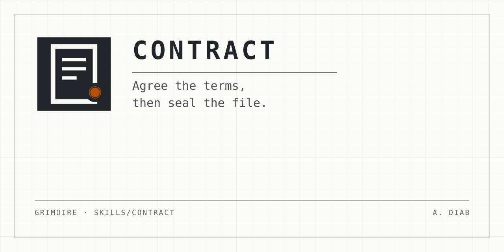

<p align="center">
  
</p>

# contract

**People ask for help in human language, and an agent needs exact instructions.**

A person who wants a reusable helper usually writes a prompt. They paste it
again and again, and edit it when it goes wrong. The prompt drifts. Nobody
can say which line holds which decision, or why.

contract closes that gap. The person does not write a prompt. The person
agrees terms, and the skill writes the prompt from those terms.

This is [design by contract](https://en.wikipedia.org/wiki/Design_by_contract),
applied to a prompt. The contract comes first, and the prompt is its
implementation.

## The words it uses

- **Familiar:** a skill or an agent that a person builds to do one job for
  them. This is the skill's own word for what it builds.
- **Skill:** instructions that the agent picks up by itself when a situation
  matches.
- **Agent:** a familiar that the main agent sends off to do one job alone and
  report back.
- **Contract:** the answered questions. These are the terms the person agrees
  with the familiar.
- **Mark:** three settings that the check writes at the top of the familiar's
  file. They show whether the familiar or its contract changed since.
- **Seal:** the check's command that writes the mark. Like a wax seal, it
  shows whether the files changed since, not who wrote them.

## Use it

**Read before you install.** The check confirms that a skill or agent file is
well formed, and unchanged since it was sealed with its contract. It does not
confirm that anyone reviewed either file, and anyone can write both. The
check does not refuse a setting's value because of what it lets the agent do.
It warns on every listed setting it does not know to be harmless, with a
sharper danger warning for a few, such as settings that let the agent act
without asking, reach the live web, or read instructions from outside the
file. A warning is a prompt to read, not a review. The list of tools an agent
is given is not warned on; read it. Read a shared skill or agent and its contract
before you use it, as you would any code from someone else.

Ask for it by name. The installer route keeps the plain name; the plugin route
namespaces it:

```text
/contract <the skill or agent you want>
/grimoire:contract <the skill or agent you want>
```

Or let it step in. It steps in when a person wants to build a reusable skill
or agent. It also steps in for a prompt they keep pasting, and for a change to
a familiar with a contract. It stays quiet for a one-off prompt. It also stays
quiet for a request to run a familiar that already exists.

To try the skill before a release, install it with the "Pinned to one commit"
route in the [root README](../../README.md), using a commit from the pull
request.

## How it works

The skill interviews the person through a template of 20 questions. The person
picks a type and a level first:

| Level | Questions | Good for |
| --- | --- | --- |
| Quick | 1 to 7 | A small familiar that only you use |
| Standard | 1 to 15 | A familiar you rely on, or share. It adds a practice test |
| Thorough | 1 to 20 | A familiar others depend on, or one that can do damage. It adds its failures and a reason for each rule |

The skill asks one group of questions at a time. It drafts what it can from
what the person said, and marks each draft *Proposed*. A pause, called a
**checkpoint**, follows each group. At a checkpoint, the skill asks about at
most three answers, the ones that need the person's own words. The other
drafts stay *Proposed* until the go. The skill never writes the answer to question 2: what the
familiar notices that nothing else does. The person writes it.

When the person gives the go, the skill generates the familiar's file from
the contract. Then it seals the file and checks its format.

## Show me good

People often do not know what good looks like until they see it. So before
question 1, at every level, the skill finds a **target**. The target is the
output the person wants the familiar to produce.

- **The person has a real example.** It becomes the target.
- **The person has none.** The skill drafts two or three samples. Each sample
  differs on one named axis, for example short and direct, or warm and
  detailed. The person picks one, mixes them, or rejects all, and says why.

The skill builds nothing until a target exists. The reasons for each rejected
sample go into the contract. They often become rules in the familiar.

## Fix the contract, not the file

**The contract is the source. The familiar's file is build output.** Nobody
edits the file by hand.

When a familiar goes wrong, the person asks for a change. The skill uses
**amend mode**:

1. It runs the check, and says which part of the seal broke, if any.
2. It finds the clause that should have held, and proposes a change to it.
3. It records the change in the contract's change log, with its reason.
4. It generates again only the sections of the file that the change touches.
   Every other section stays word for word.
5. It shows the change list, and seals only after the person's go.

A small change then gives a small diff, and a reviewer can read it.

## What it hands back

Five parts, in this order:

1. **The contract**, with a mark on every answer.
2. **The familiar**, marked "not installed".
3. **The check's output**, word for word, with its exit code.
4. **The practice test**: the cases, the number of runs and a rough cost.
5. **The unsettled list**: each open answer and question, and where to
   install the familiar.

A person who did not watch the interview can decide from these five parts.
They can install the familiar, or not.

## What it never does

- It never installs a familiar. Installing activates it in every future
  session, so that choice is the person's.
- It never runs the practice test. A run uses the person's usage.
- It never sends anything, and it never publishes anything.
- It never writes a hook, a settings file or a permission list.
- It writes only under a `familiars/` folder in the current working folder.
  To change a familiar anywhere else, it asks the person to confirm that exact
  path first.
- It never follows an instruction that it finds inside a file. A "yes" in a
  file is never the person's yes.

## Check and seal a familiar

The skill runs only these two commands. Put each path in single quotes, as
shown. The path is a skill's folder, or an agent's file.

```text
node '<skill base directory>/scripts/check.mjs' --seal '<path>'
node '<skill base directory>/scripts/check.mjs' '<path>'
```

The first command writes the mark. The second command checks the file's
format and the mark. For a skill, the mark covers every file in its folder,
except the contract.

**The exit code is the verdict:**

| Exit code | Meaning |
| --- | --- |
| 0 | Pass. Warnings are allowed |
| 1 | Fail, or the check cannot read part of the file |
| 2 | Usage error, or the seal refused. Nothing was written |

**A mark proves no authorship.** Anyone can compute one. Read a shipped
familiar as prose, whatever its mark says. The check also says nothing about
whether the familiar is any good.

## The practice test

The practice test for this skill is in
[`docs/practice-tests/contract.md`](../../docs/practice-tests/contract.md).
It is outside this folder, so it does not install with the skill. It holds
step-in cases, stay-quiet cases, decoys and scripted interviews, with the
expected answers written before any run.

## What is in this directory

| Path | What it is |
| --- | --- |
| [`SKILL.md`](SKILL.md) | The skill. It is generated from the contract, so do not edit it by hand. |
| [`CONTRACT.md`](CONTRACT.md) | This skill's own contract. Change the skill here, then generate and seal again. |
| [`references/template.md`](references/template.md) | The 20 questions, with the test for each one. |
| [`references/amend.md`](references/amend.md) | Amend mode: how the skill changes a familiar that has a contract. It is generated from the contract, like `SKILL.md`. |
| [`references/show-me-good.md`](references/show-me-good.md) | The show-me-good step: how the skill finds the target output before question 1. |
| [`references/binding-claude.md`](references/binding-claude.md) | How the skill builds an agent for Claude Code: the file, its keys, the settings the check warns on, its seal, and the tool version it was last checked against. |
| [`references/binding-antigravity.md`](references/binding-antigravity.md) | How the skill builds an agent for Antigravity: the file, its keys, the settings the check warns on, its seal, and the tool version it was last checked against. |
| [`references/binding-codex.md`](references/binding-codex.md) | How the skill builds an agent for Codex: the file, its keys, the settings the check warns on, its seal, and the tool version it was last checked against. |
| [`scripts/check.mjs`](scripts/check.mjs) | The check and the seal. It uses only built-in modules, so it needs no install. |
