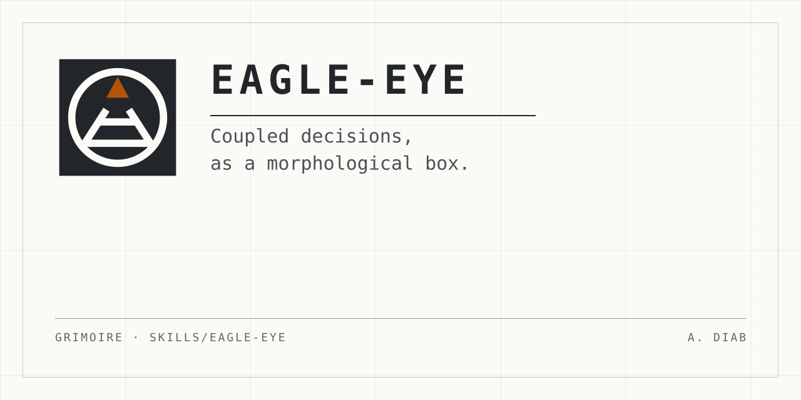

<p align="center">
  
</p>

# eagle-eye

**A decision is made once it has been seen against the whole system.**

Most tools ask about one decision at a time. That works until the decisions
are coupled: picking the cheap database changes what the deployment can be,
which changes who can be on call. A list of questions then hides the thing you
need to see.

eagle-eye draws a **morphological box** instead. One row per decision. One
cell per option. An **edge** between two options that rule each other out, or
that require each other. Then it renders a page that reads any configuration
back.

**Live example: [the decision to publish this repository][demo].** Click an
option and watch the grid recolour. That page was written by the skill, about
itself.

[demo]: https://mephistopheles4.github.io/grimoire/

## Use it

Ask for it by name:

```text
/eagle-eye <topic>
```

Or let it trigger. It fires on three or more open decisions, where one choice
changes what is possible in another. Two independent choices never earn a box.

## What the page tells you

Seven findings. Six read the configuration you are looking at. The seventh
reads the box itself.

| Finding | What it points at |
| --- | --- |
| row not opened | A row with edges to the rows you changed on the page, that you did not open. |
| weakest edge | The lowest-evidence edge your verdict depends on. Measure this one first. |
| most connected | The option with the most edges. Change it and the most moves. |
| row with no edges | Independent, or an edge is missing. |
| strawman not rejected | A deliberately weak option that nothing rules out. Give the reason, or pick it. |
| chain | Edges that join into a relation, and whether the box says that relation itself. A cycle reports on its own. |
| evidence for the verdict | If every edge is true, can the set still be wrong? Names the rows whose active edges are all argued. |

## Why the edges carry a tier

Every edge states **why**, and every edge is `measured`, `sourced`, or
`argued`. An argued edge is your reasoning, and the page colours on it exactly
as hard as it colours on a measurement. Naming the tier is how you find out
that a confident-looking verdict rests on three guesses.

## Run the renderer by hand

No install, no dependencies. Node 20 or later:

```bash
node skills/eagle-eye/render.mjs <box.json> --out page.html
```

| Flag | What it does |
| --- | --- |
| `--check` | Validates a box and prints the findings. Writes no file. |
| `--out <page>` | Writes one self-contained HTML file. |
| `--sel "row: opt-a, opt-b"` | Reads a configuration from the command line. |

## What is in this directory

| Path | What it is |
| --- | --- |
| [`SKILL.md`](SKILL.md) | The skill. The prose an agent follows. |
| [`render.mjs`](render.mjs) | The renderer and the validator. |
| [`box.schema.json`](box.schema.json) | The shape of a box file. |
| [`lib/`](lib) | The one module the page and the tests both run. |
| [`reference/`](reference) | How to write an edge, and the rest of the reference. |
| [`examples/`](examples) | A complete box: the skill's own design, boxed. |

The renderer names no fixed path to itself, so this directory runs from
wherever it lands.
