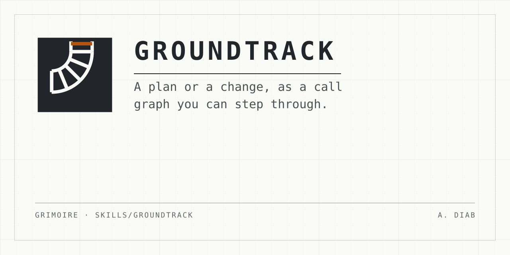

<p align="center">
  
</p>

# groundtrack

**A reader who did not write a change cannot see its shape.**

A change arrives as a list of files. A plan arrives as a list of tickets.
Neither says what calls what, what each part hands back, where it can break, or
what it needs in order to work.

groundtrack turns durable material into a call graph a reader can step
through. The agent reads the material and writes one `<topic>.flightpath.json`
by hand. That file states one graph and one or more recorded walks through it.
A zero-dependency renderer turns it into one self-contained page.

## The three channels

Every node carries three channels, and they are the point of the drawing.

- **A** — what flows out of the node.
- **E** — where it breaks. Each failure tag is a **retry**, an **escape**, or a
  **die**.
- **R** — what it needs to work.

## Use it

Ask for it by name. The installer route keeps the plain name; the plugin route
namespaces it:

```text
/groundtrack <a plan, a change, a path>
/grimoire:groundtrack <a plan, a change, a path>
```

It works on a plan already made or work already done. It does not work on a
conversation, because nothing durable exists to check the graph against.

## The page

The page draws the graph and steps a cursor over one recorded walk. Nothing is
computed while you watch. Every branch an `if` took, every value an effect
returned, and every catch is a literal in the file. That is what makes the walk
a list of checkable claims rather than a program you have to believe.

On the page you can:

- Step forward and back, play the walk, and hold it on the next effect or the
  next error.
- Read the call stack, the inputs, the error path, and the effects ledger.
- Open one node in the cutaway: its steps, the files it touches, and its
  contract. The cutaway follows the cursor while the walk plays.
- Flip between the drawing and a tree. Pan by dragging or with the wheel; zoom
  with ctrl and the wheel.
- Redraw the graph under a **layer**. Flip to the test layer, and a node that
  still reaches the real network is a design defect you can see.

The page makes no network request. Three monospace faces ship with the skill
and are inlined into it.

## Run the renderer by hand

```bash
node skills/groundtrack/scripts/render.mjs <topic>.flightpath.json --check
node skills/groundtrack/scripts/render.mjs <topic>.flightpath.json --out page.html
node skills/groundtrack/scripts/render.mjs <topic>.flightpath.json --text
```

| Flag | What it does |
| --- | --- |
| `--check` | Validates. Refusals on standard error, exit 1. Findings on standard output, exit 0. |
| `--out <page>` | Writes one self-contained HTML file. |
| `--text ["<run>"]` | Prints the same graph as an indented tree, for one run. |

## What is in this directory

| Path | What it is |
| --- | --- |
| [`SKILL.md`](SKILL.md) | The skill. The prose an agent follows. |
| [`scripts/render.mjs`](scripts/render.mjs) | The renderer, the validator, and the text output. |
| [`scripts/groundtrack.js`](scripts/groundtrack.js) | The one module the page and the tests both run. |
| [`references/flightpath-file.md`](references/flightpath-file.md) | The shape of a flightpath file. |
| [`references/writing-walks.md`](references/writing-walks.md) | How to write a walk, and the two mistakes measurement says you will make. |
| [`examples/`](examples) | Three complete files: a small one, a real pull request with a test layer, and a plan of sixteen tickets. |
| [`assets/`](assets) | The page template and the three vendored faces. |

## The honesty property, and its limit

The material is durable, so a sceptical reader can check the drawing against
it. The validator proves the walk is a legal path through the graph the file
declares. **It cannot prove which branch was taken or what an effect
returned.** Those stay the author's claims, and the skill says so rather than
hiding it.
