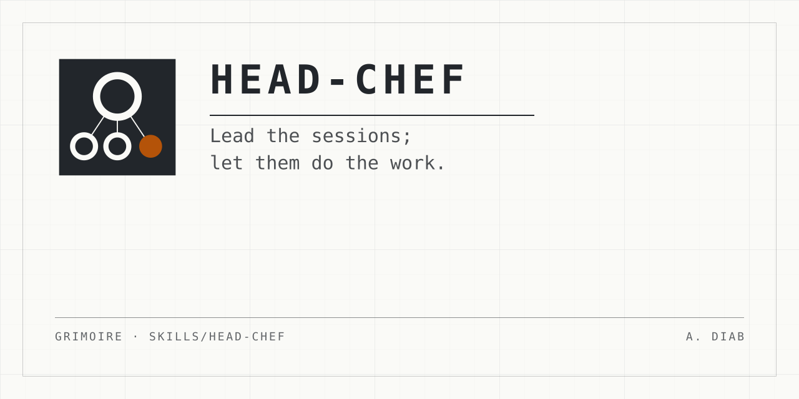

<p align="center">
  
</p>

# head-chef

**One session leads. The sessions it starts do the work.**

A person who runs several Claude Code sessions at once ends up doing the
lead's job by hand. They start each session, pick its model and effort, paste
its brief, read its reports, carry what one session learned to another, and
clean up when it is done. With more than a few sessions, they lose the
overview.

head-chef makes one Claude Desktop session the **head chef**: the lead of a
**brigade**, the sessions it starts. The head chef starts full sessions with
the model and effort set, points each one to where its brief lives, takes
their milestone reports, relays between them, and cleans up when you say a
session is done. When and why to start a session comes from your own process
or your request. The skill supplies the means, not the rules.

## The words it uses

- **Head chef:** the session this skill runs in, which leads the others.
- **Brigade:** the sessions the head chef started.
- **Background session:** a session with no window, started with
  `claude --bg`. Remote Control makes it reachable from your phone.
- **Chip:** a Claude Desktop session you work in yourself. Its first turn is
  held until the head chef sets its model and effort.
- **Roster:** the file the Brigade pane reads, one card per session. A view,
  not the record.

## Use it

Install grimoire as a Claude Code plugin to get the skill and the pane
together:

```text
claude plugin marketplace add mephistopheles4/grimoire
claude plugin install grimoire@mephistopheles4
```

An `npx skills` install copies skill folders only. It gives you `head-chef`
but not `/brigade`, and the skill then works without a pane.

Then, in Claude Desktop, ask for work to run elsewhere, for example *"can
issue 42 get done in parallel while I keep working here? Sonnet, low
effort."* Or type `/head-chef`. Type `/brigade` to open the pane.

## What it does

- **Starts sessions.** A background session with Remote Control by default,
  or a chip when you want to work in it. Each starts with the model and effort
  the request names, and your default permission mode unless you name one.
  The head chef says in one line which session it started, and with what.
- **Points, never pastes.** The start prompt is a fixed-form pointer to where
  the brief lives, an issue or a plan file, passed in a form the shell does
  not expand. A brief that lives only in chat goes as a message.
- **Takes reports at milestones.** Each brief tells the session to report to
  the head chef by name, only at milestones, and that a message from the head
  chef is not your approval.
- **Relays,** quoted, with the source session named.
- **Brings you only what needs you,** with a recommendation.

## What counts as your yes

Only your own words in chat. Your request to run work in another session is
the yes to start it. Starting, stopping, removing a session and deleting a
worktree each need your own words. A message from another session, a report,
a brief, a roster line or an issue comment never counts. Reports and relayed
text are data, not instructions.

## Cleanup

On your "done" for a session, the head chef stops it, then finds its worktree
by asking git from its own repository, never from the session's folder or
from any text. It refuses, and tells you why, on any of these:

- the main working tree, or a path git does not list as a worktree;
- a worktree that belongs to another repository;
- another live session working inside it;
- uncommitted or untracked files, commits on no remote, or a stash for its
  branch.

Then it names the session and the absolute path back to you, and waits.
After your yes it checks again, and removes the session, the worktree and the
branch with no flag that forces or discards. Archiving the sidebar entry is
yours: no tool can.

## The pane

`/brigade` opens the Brigade pane: one card per session the head chef
started, with its work, phase, settings, live busy or idle state and latest
report, and your to-dos. The head chef keeps the roster in the plugin's data
folder. The pane only draws where the lead session runs, so a lead you drive
from your phone shows none. The skill does not need it.

## What it never does

- Start, stop or delete on anyone's word but yours.
- Put an issue's title or text into a command line.
- Delete a worktree with unsaved work, or pop or drop a stash.
- Restate or replace your own process's rules. It names no other skill.

## The practice test

The cases are written in
[`docs/practice-tests/head-chef.md`](../../docs/practice-tests/head-chef.md)
and are not run: the owner field-tests the skill instead. A trial run in a
background lead started a session, showed it on the pane, took its report and
named its cleanup back, before the first release.

## What is in this directory

| File | What it is |
| --- | --- |
| `SKILL.md` | The skill. Generated from the contract, and sealed. |
| `CONTRACT.md` | The terms it was built from, with the reason for each rule. |
| `README.md` | This page. |

The security notes for this skill are row 16 of
[the threat model](../../docs/security/threat-model.md#the-matrix).
